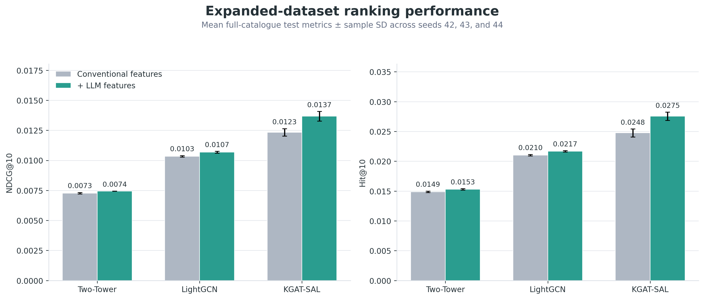
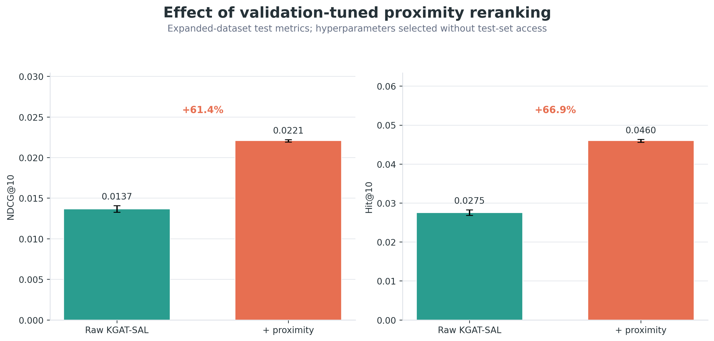

# Foodie Revamp

Foodie Revamp is a restaurant recommendation study built from Google Places
metadata and public Google Maps reviews. It evaluates conventional and
LLM-derived user and restaurant features in a Two-Tower reference model,
LightGCN, and KGAT-SAL, followed by validation-tuned geographic reranking and a
GraphRAG explanation layer.

## Dataset

The current frozen experiment is the September 2026 expanded dataset:

- 158,981 eligible users;
- 85,381 catalogued restaurants;
- 67,947 restaurants in the full-catalogue ranking population;
- 789,505 training, 158,981 validation, and 158,981 test interactions;
- three seeds (42, 43, and 44), 300 epochs, and 1,024-dimensional embeddings.

The underlying dataset is not distributed in this repository. Researchers
interested in the dataset can email [swami.me@gmail.com](mailto:swami.me@gmail.com).

## Key results

All values below are mean full-catalogue test results across seeds 42, 43, and
44. Model checkpoints were selected using validation NDCG@10.

| Model | Feature set | Hit@10 | NDCG@10 |
|---|---|---:|---:|
| Feature Two-Tower | Conventional | 0.01487 | 0.00727 |
| Feature Two-Tower | Conventional + LLM | 0.01530 | 0.00744 |
| LightGCN | Conventional | 0.02101 | 0.01034 |
| LightGCN | Conventional + LLM | 0.02167 | 0.01068 |
| KGAT-SAL | Conventional | 0.02475 | 0.01234 |
| **KGAT-SAL** | **Conventional + LLM** | **0.02754** | **0.01367** |
| **KGAT-SAL + proximity** | **Conventional + LLM** | **0.04597** | **0.02206** |

The principal findings are:

- KGAT-SAL was the strongest raw recommender under both feature conditions.
- LLM-derived features improved every architecture, but the gain was
  asymmetric: KGAT-SAL improved by 11.3% in Hit@10 and 10.8% in NDCG@10,
  compared with gains of 2.4–3.3% for Two-Tower and LightGCN.
- Validation-only proximity tuning selected a blend weight of 0.6, a 2.5 km
  bandwidth, and a candidate depth of 1,600. Applied to KGAT-SAL with LLM
  features, it improved Hit@10 by 66.9% and NDCG@10 by 61.4% over the raw
  model.
- These results support the study's central hypothesis: semantic features are
  most useful when the architecture can propagate relational information, but
  geographic relevance remains a distinct signal that semantic modeling does
  not replace.

### Effect of LLM-derived features



### Effect of proximity reranking



See [the expanded result summary](results/expanded_2026-09-21/expanded_proximity_summary.md)
and [the complete model comparison](results/expanded_2026-09-21/comparison_report.md).
The exact run configuration is recorded in the
[experiment manifest](results/expanded_2026-09-21/experiment_manifest.json).

## Repository layout

| Path | Purpose |
|---|---|
| `article/` | Current technical-article drafts, figures, Google Docs-ready exports, and editorial handoff material |
| `analysis/` | Reproducible EDA, segment evaluation, and supporting tables |
| `foodie/collection/` | Places discovery, review scraping, budget controls, and dataset freezing |
| `foodie/features/` | Canonical data preparation, feature generation, audits, and feature contracts |
| `foodie/modeling/` | Recommender implementations, experiment runners, reranking, and summaries |
| `foodie/explanations/` | GraphRAG generation, remediation, and explanation audits |
| `foodie/evaluation/` | Publication tables and rating-aware evaluation |
| `results/expanded_2026-09-21/` | Current per-seed metrics, aggregate comparisons, proximity grid, and frozen selection |
| `tests/` | Regression tests for split integrity, feature generation, collection safeguards, and GraphRAG remediation |
| `systemd/` | User-service definitions for long-running collection and experiment jobs |
| `literature/` | Literature index and cited research papers, organized by topic |
| `data/`, `models/` | Large generated artifacts, excluded from Git |

## Data collection and review scraper

The collection and scraper implementation is included in the repository under
`foodie/collection/`. It contains the Google Places collector, API cost and
budget safeguards, Camoufox-based Google Maps review scraper, concurrent batch
runner, challenge-aware retry guard, dataset finalization checks, systemd units,
and monitoring scripts. The collected data, browser state, credentials, and
API keys are intentionally excluded from Git.

## Main pipelines

Run project entry points as modules from the repository root. For example:

```bash
/home/swami/venv/dev_env/bin/python -m foodie.collection.run_places_then_reviews --help
/home/swami/venv/dev_env/bin/python -m foodie.features.build_training_features --help
/home/swami/venv/dev_env/bin/python -m foodie.modeling.run_expanded_model_experiments
/home/swami/venv/dev_env/bin/python -m foodie.explanations.run_publication_graphrag --help
```

See [SCRIPT_LAYOUT.md](docs/SCRIPT_LAYOUT.md) for the categorized inventory
and entry-point convention.

## Reproducibility note

The interaction split is chronological leave-two-out after user-restaurant
deduplication. Behavioral and LLM-derived features are constructed from
training evidence only. Validation selects checkpoints and proximity
hyperparameters; the test split is evaluated after those choices are frozen.
