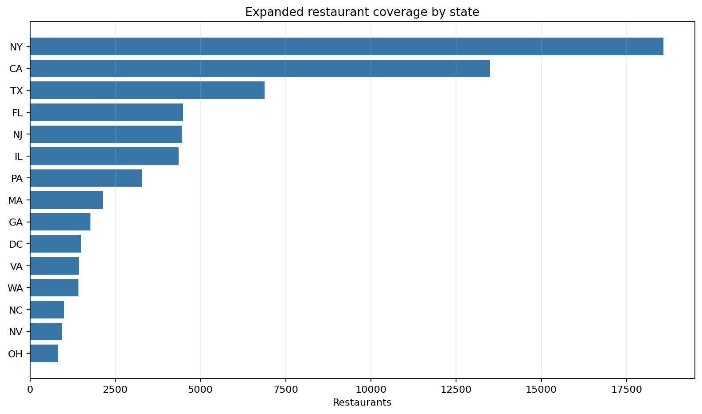
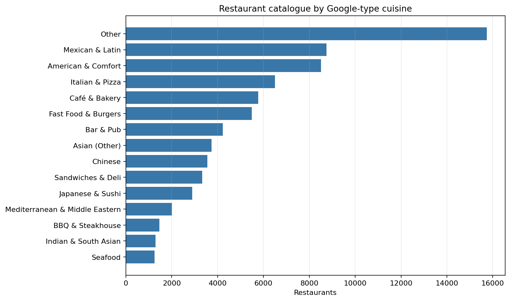
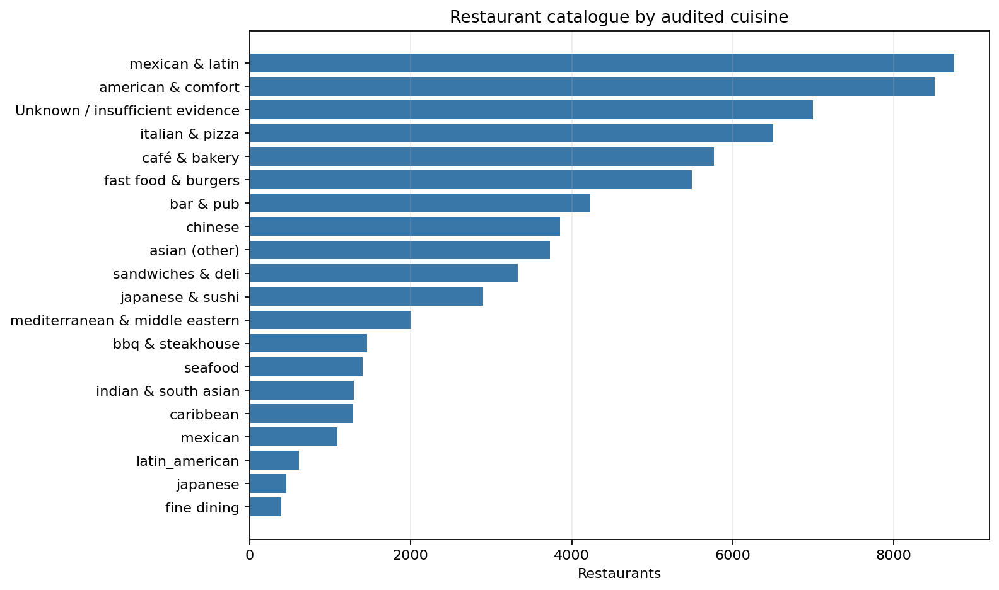
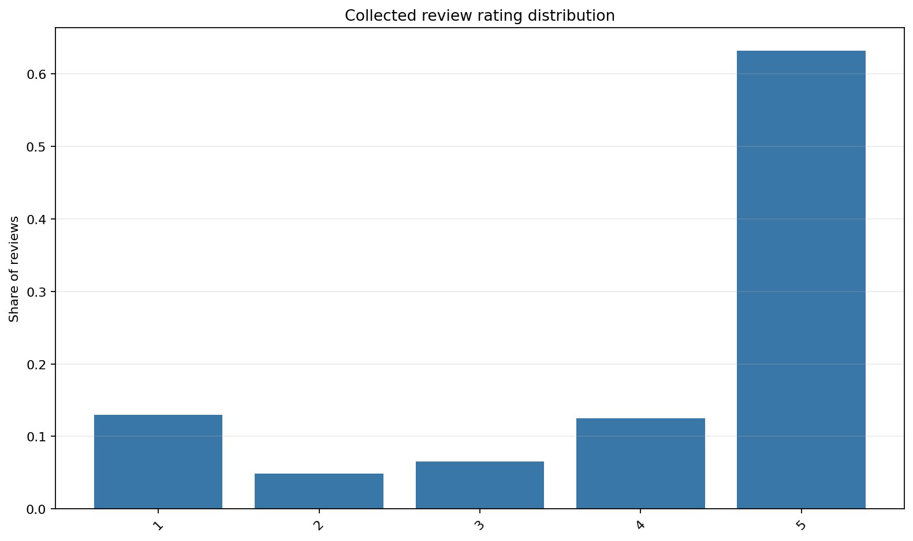
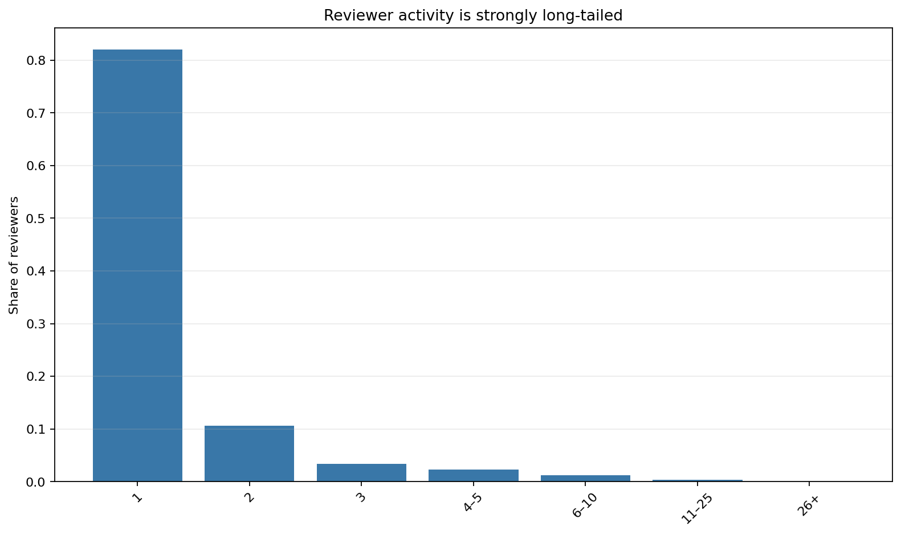
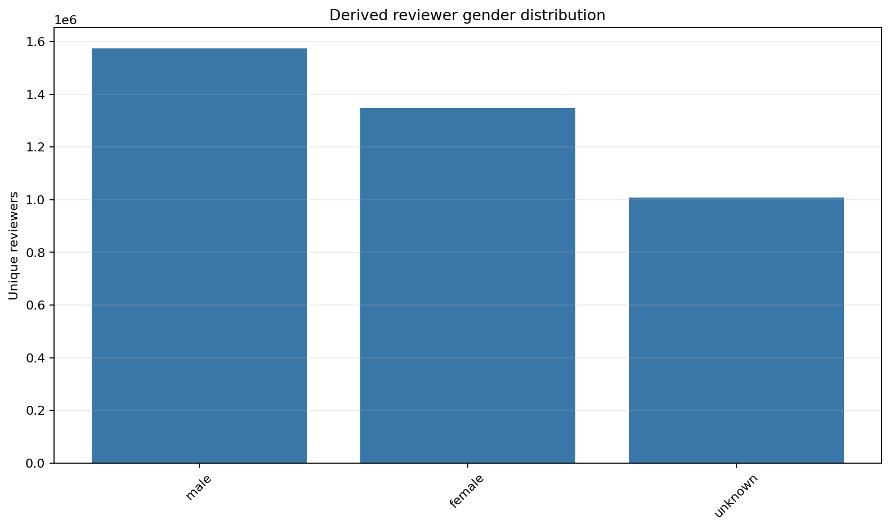
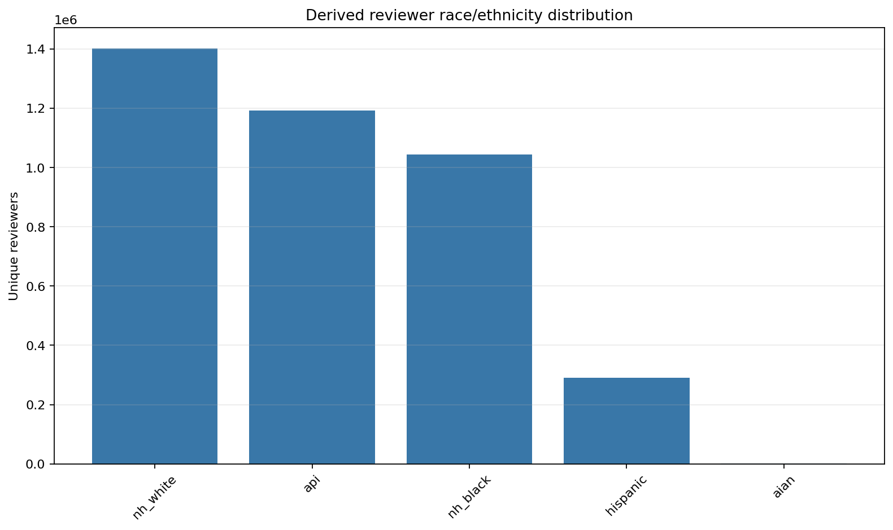

# Expanded dataset exploratory analysis

Generated from the frozen canonical files by `analysis/expanded_eda/run_eda.py`.

## Executive profile

The expanded catalogue contains **75,203 restaurants** across
**7,199 canonical restaurant CBGs** and **49 states/DC**.
**70,625 restaurants (93.9%)**
have at least one collected review; **4,578** have none.
The review table contains **5,544,947 rows**, representing
**5,544,947 unique review IDs** from
**3,930,034 identified reviewers**.

Relative to the archived article's pre-expansion discovery catalogue of
44,630 restaurants, the current catalogue is larger by
**30,573 (68.5%)**.
This comparison is a historical-baseline comparison, not an attribution of
every added restaurant specifically to the final density-CBG pass.

## Collection-to-analysis funnel

The frozen scraper audit recorded **5,545,260 review objects**.
Canonical processing retained **5,544,947 analytical rows**,
removing **313 (0.0%)**
that did not satisfy the flattening pipeline's identity requirements. Similarly,
**8,942 CBGs** produced at least one restaurant hit
during tiled discovery, whereas the deduplicated restaurant catalogue contains
**7,199 canonical CBG assignments** because a restaurant found from
multiple search tiles is stored once. These counts measure different stages and
should not be used interchangeably.

## Geographic coverage

The leading states are NY (18,575), CA (13,483), TX (6,883), FL (4,489), NJ (4,467). The final population-density search queue covered
all 51 state/DC jurisdictions: 2,466 of its top
10,000 CBGs had already been queried and 7,534 required
new searches. The resulting canonical restaurant catalogue represents 49
states/DC; Alaska and Montana produced no retained restaurant records.

## Catalogue composition and LLM cuisine audit

The primary descriptive cuisine chart currently uses the deterministic
Google-type taxonomy. Its largest categories are Other (15,747), Mexican & Latin (8,748), American & Comfort (8,510), Italian & Pizza (6,498), Café & Bakery (5,768).

Google's broad type mapping originally left **15,747
(20.9%)** restaurants as `Other`.
The audited targeted repair assigns a supported cuisine when evidence exists and
retains **6,996
(9.3%)** as
`Unknown / insufficient evidence`; it never forces a label. `Other` was not
created only by expansion: `tables/cuisine_other_by_collection_cohort.csv`
reports both the pre-expansion and added-after-old-EDA cohorts.

## Reviews and model population

Review text is present for **83.6%** of rows and
**30.4%** contain at least one attached photo. The mean
stored text length is **265.2 characters**.
There are **156,261 reviewers with at least four unique rated restaurants**,
exactly matching the publication leave-two-out population. They contribute
772,170 training interactions plus
156,261 validation and
156,261 test targets.

## Derived reviewer demographics

Gender predictions are available for **2,922,735**
of 3,930,034 identified reviewers, and race/ethnicity
predictions for **3,930,034**. These labels are
derived from reviewer names rather than self-reported and must be interpreted as
noisy proxy variables. The rebuild used the exact historical method: first-token
`gender_guesser` for gender and `pparasurama/raceBERT` on the full display name
for race. There are **0** missing gender
predictions and **1,007,299** explicit `unknown`
predictions; these are distinct states.

## Integrity and limitations

The frozen collection audit reports **0 unresolved integrity issues**.
The search frame is national, but the retained restaurant catalogue has no
Alaska or Montana observations and is deliberately concentrated in high-density
and previously high-foot-traffic CBGs; it is not a uniform sample of US
restaurants. Places metadata and review availability can also differ by
market, restaurant age, and Google Maps visibility. Demographic labels are
probabilistic name-based inferences and should be used for diagnostic fairness
analysis, not treated as ground truth or sensitive targeting features.

Detailed tables are under `analysis/expanded_eda/tables/`.
