# Part 1 — Building the Dataset: From Foot-Traffic Priors to a 2.5M-Review Graph

*How we built a restaurant-recommendation dataset from scratch: foot-traffic priors, hexagon-tiled API discovery, browser-driven review scraping, and a 2.5-million-node graph.*

> **Series:** *Building a restaurant recommender from 2.5M Google reviews — graphs, local LLMs, and geography.* Part 1 of 4.

---

## The problem with recommending restaurants

Most recommender-system tutorials start with a gift: a ratings matrix. MovieLens hands you users, items, and stars, neatly joined. Real recommendation problems rarely begin that way, and restaurants are a particularly unforgiving case. There is no central "users × restaurants" table. People don't rate every place they visit. The catalog is hyper-local — a great recommender for Manhattan is useless in Houston — and the long tail dominates: most restaurants have a handful of reviews, and most reviewers have written only one or two. Each of those is a design constraint before it is a modeling choice, and most of this first part is about confronting them one at a time.

### What are we actually recommending?

There's a second, subtler gap — not about *data* but about *granularity*. Almost every restaurant recommender treats a restaurant as a single, monolithic item: it ranks **venues as a whole**, using aggregate attributes (cuisine, price tier, average rating, distance) plus collaborative signals about who else liked the place. But that's not quite the decision a diner makes. People don't just choose a restaurant — they choose *what to order*, and they carry strong, idiosyncratic **food preferences** (spice tolerance, adventurousness, a weakness for a particular dish) that a venue-level rating washes out.

This dish-level, preference-level view is surprisingly underdeveloped in the literature. Surveys of the field — Min et al.'s *A Survey on Food Computing* and Anderson's *A Survey of Food Recommenders* — find that research clusters around two poles: **recipe/meal recommendation** (cook-at-home) and **restaurant recommendation** (which venue). Recommending the *specific dishes* a person is likely to enjoy *within* a restaurant, conditioned on their personal palate, falls into the gap between them; reviewers of the field explicitly note that current systems "lack the capability to recommend restaurant dishes to users based on that user's persona." The reasons are practical: dish-level interaction data is rarely logged or public, menus are unstructured and wildly inconsistent, and sparsity explodes once you go below the venue level.

We took that gap as a design goal. Rather than treat each restaurant as an opaque 4.3-star blob, we mine **dishes** out of the review text and promote them to first-class entities in the graph (the 517K dish nodes in the summary below), and we build per-user **preference fingerprints** from how people write about food. How we extract those — and a candid finding about which of them actually moved the needle — is the subject of Part 2. First, the foundational problem.

So before any modeling, we had a data problem: **where do we even get a dense, geographically-grounded signal of who eats where?**

Our answer was to invert the usual order. Instead of starting from restaurants, we started from **places people actually go** — using anonymized foot-traffic data to find the densest dining neighborhoods in the United States — and only then went looking for the restaurants and the reviews. This post walks through that pipeline end to end, and ends with the graph that the rest of the series is built on.

The final dataset, in one line:

> **666 Census Block Groups · 18,879 restaurants · 1.96M reviewers · 2.5M reviews · 517K dishes — a 2.5-million-node graph.**

---

## Step 1 — Finding the densest neighborhoods

A **Census Block Group (CBG)** is the second-smallest geography the US Census publishes — typically 600–3,000 people, a few city blocks. Small enough to capture "a neighborhood," large enough to have stable statistics: an ideal unit for a *local* recommendation problem. To rank CBGs by dining activity we used **SafeGraph Patterns** — anonymized, aggregated mobile-location data — ordering each block by its count of distinct visitors. The top of that list reads like a map of American density: Manhattan, then Los Angeles, then Houston.

> **How does SafeGraph know where people go?** The Patterns dataset is built from a **panel of opt-in, anonymized smartphones** — on the order of **45 million US devices** sending GPS pings from apps that have integrated SafeGraph's SDK. Those pings are matched to **~3.6–4 million commercial points of interest** using building-**footprint polygons** (not just a centroid + radius, which matters a lot in dense downtowns where POIs sit meters apart), then aggregated into weekly — and hourly — visit counts, dwell times, and visitor home-CBG distributions. Crucially, this is a *sample*, not a census: independent analysis puts the average sampling rate around **7.5%**, with real **geographic and urban–rural biases**. For us that's an acceptable trade-off — we only need a *relative* ranking of which neighborhoods are dining-dense — but it's a caveat worth stating plainly, and a reason we treat the CBG selection as a prior to be validated by actual review volume, not as ground truth.

We made no attempt to cover the whole country; the goal was density, not coverage. Starting from the **top 2,000 blocks** by visitor count, we grew the footprint outward — nearby blocks within ~50 km (a recommender needs *nearby alternatives*, not just the single hottest corner) and dense residential blocks within 10 km — reaching roughly 4,500 candidate CBGs. What happened next is a useful reminder that a foot-traffic ranking is only a prior, not the answer. Of the **4,477 CBGs we queried**, **2,705** returned at least one restaurant, and only **666** held a restaurant with reviews worth scraping. That attrition from 4,477 to 666 is precisely the gap between *where phones go* and *where reviewable dining actually sits* — which is why we treat the surviving **666**, rather than the set we originally selected, as the project's canonical footprint.

*(A practical aside: CBG codes are 12-digit identifiers that data tools love to parse as floats, silently corrupting any that begin with a zero. Coerce them to zero-padded strings before joining, or every downstream merge fails quietly.)*

> [FIGURE: data funnel — 4,477 CBGs queried → 2,705 productive → 666 in graph; 44,630 restaurants discovered → 18,879 reviewed — alongside a US map of the 666 CBGs sized by visitor count.]

---

## Step 2 — Finding the restaurants: hexagon-tiled discovery

A CBG is a polygon, but the Google Places API searches *circles*. Covering an irregular polygon with circles is the classic packing problem — and our solution was **Uber's H3 hexagonal grid**.

> **Why hexagons (and why H3)?** [H3](https://h3geo.org/) is an open-source hexagonal hierarchical spatial index that Uber developed for ride pricing and dispatch and [open-sourced in 2018](https://www.uber.com/blog/h3/) (Apache 2.0). It tiles the globe into hexagonal cells at 16 resolutions, each cell encoded as a compact 64-bit id. Hexagons beat a square grid for this kind of spatial sampling for one main reason: **uniform adjacency** — every neighbor shares an edge and sits the same distance from the center, whereas a square's diagonal neighbors are ~1.4× farther than its edge neighbors. That regularity means a hex centroid plus a fixed search radius covers its cell with minimal overlap and few gaps — exactly what you want when each covered cell is a billable API call.

For each CBG we:

1. Pulled the block-group **boundary polygon** from the Census TIGER/Line files via `pygris` (trying vintages 2010 → 2019, since SafeGraph uses 2010 GEOIDs).
2. Tiled the polygon with **H3 hexagons at resolution 9** (~174 m edge, ~350 m across).
3. Fired one **Google Places (New) `searchNearby`** request at each hexagon's centroid: `includedTypes=["restaurant"]`, **250 m radius**, `maxResultCount=20` (the API's hard cap — we wanted 50; 20 is the ceiling).

A small **early-stop heuristic** kept costs sane: if the first two hexagons of a CBG returned nothing, we skipped the rest of that block.

> [FIGURE: one CBG polygon tiled with H3 res-9 hexagons, each with its 250 m search circle — illustrates the packing.]

Each restaurant came back enriched with the fields we'd later turn into features: `displayName`, `formattedAddress`, `location`, `types`, `rating`, `userRatingCount`, `priceLevel`, `nationalPhoneNumber`, `websiteUri`.

The targeting is what kept the bill modest. Restaurant discovery cost **$751.33** across **23,479 API calls** (all successful) at $0.032/request on the Advanced field tier, returning 59,024 restaurant rows that deduplicated to **44,630 unique places**. The hexagon packing and the early-stop heuristic weren't only tidy engineering — they were what held a search at this scale to a few hundred dollars rather than tens of thousands.

Google's raw `types` are noisy (a place can be `restaurant`, `food`, `establishment`, `point_of_interest`, `meal_takeaway`, …). We mapped ~320 type tokens down to **17 canonical cuisine categories** (American & Comfort, Mexican & Latin, Chinese, Japanese & Sushi, Indian & South Asian, Italian & Pizza, Fine Dining, …), walking each restaurant's type list, skipping noise tokens, first match wins, else "Other."

---

## Step 3 — Scraping the reviews

The Places API reports how many ratings a restaurant has, but not the reviews themselves at the volume we needed — and the reviews are where the signal we actually care about lives: who visited, what they ordered, how they felt. So we collected them directly from Google Maps.

This was the most engineering-heavy step in the pipeline, mostly because Maps is not built to be read by a machine. We used **camoufox** (an anti-detection Firefox build) driven by **Playwright**, with real Google session cookies harvested once from a logged-in browser profile so that Maps treated the automation as a returning, trusted user. The scraper parses the reviews panel via CSS selectors, scrolling until it has loaded up to **200 reviews per restaurant**, running **50 sessions concurrently**.

Every review yields a rich record:

- `rating`, `text`, `timestamp`
- `reviewer_name`, `contributor_id`, `is_local_guide`, the reviewer's lifetime review/photo counts
- attached photos
- and a structured **`meta`** block Google attaches: *meal type*, *price per person*, *Food / Service / Atmosphere* sub-scores, and **recommended dishes**

That `meta` block is the most valuable part of the record: the Food/Service/Atmosphere sub-scores and recommended-dish lists feed directly into the features in Part 2. Here is what a single review yields, and where each field ends up:

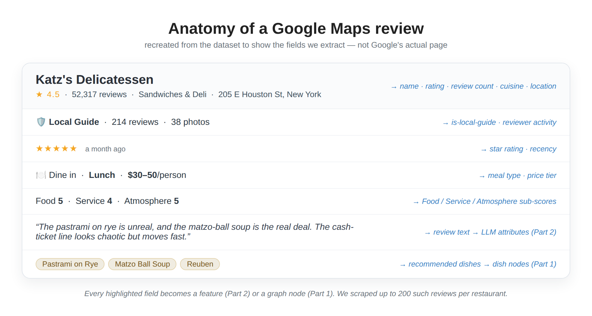

> **On ethics and terms of service.** This is browser-based scraping of a logged-in session, which sits in tension with Google's ToS. We did it for a non-commercial research project, rate-limited and on a bounded set of public reviews. Anyone reproducing this should weigh the legal and ethical implications for their own context — and prefer official APIs where the data is available.

The result: **~2.5 million distinct reviews** from **~1.96 million reviewers** across the **18,879** restaurants that had reviews to scrape.

---

## Step 4 — Who's reviewing? (and a necessary caveat)

A recommender can be accurate on average and still fail specific communities. To even *ask* that question, we needed demographic signal — which we don't have directly. So we **inferred** coarse demographics from reviewer display names:

- **Race/ethnicity** via `pparasurama/raceBERT`, a transformer that predicts five Census-style categories (`nh_white`, `nh_black`, `hispanic`, `api`, `aian`) from a name.
- **Gender** via the `gender_guesser` library on the first name (male / female / unknown).

We ran this once over every reviewer's display name and cached the result.

> **⚠️ This is the most caveat-heavy step in the project, and the article should say so plainly.** Name-based demographic inference is *probabilistic and biased*. A name is not an identity: it conflates ethnicity with naming convention, mislabels people routinely, forces gender into a binary-plus-unknown, and inherits the training biases of the underlying model. We use these labels **only in aggregate, as a lens for fairness analysis** — "does the recommender serve some groups worse than others?" — never as ground truth about any individual, and never as a model input that could encode discrimination. Roughly **25% of reviewers** couldn't be assigned a gender at all, which is itself a reminder of the method's limits.

With those caveats loud and clear, the aggregate picture (of classified reviewers):

| Race (inferred) | Reviewers |
|---|---|
| NH-White | 720K |
| Asian/Pacific Islander | 589K |
| NH-Black | 521K |
| Hispanic | 133K |

The headline behavioral finding is a reassuring one: **average ratings are nearly identical across racial groups — about 4.07–4.08 on a 5-star scale**, with local-guide shares all falling in a narrow 66–71% band. People rate restaurants remarkably similarly regardless of inferred demographics. *Whether the model serves them equally well is a separate question, and one we return to directly in Part 4.*

---

## A first look: who reviews what, and where

Before modeling, it's worth understanding the data's shape. A few patterns stood out — and one of them quietly reframes the fairness question above. *(These views use only reviewers we could classify; "unknown" and the negligibly-small AIAN group are excluded throughout.)*

### Who reviews

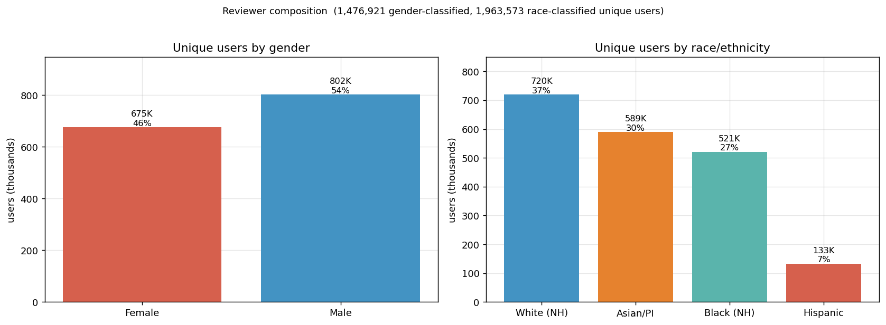

Counting *unique* reviewers rather than reviews, the panel skews male — **54% male, 46% female** among the ~1.48M users we could gender-classify (802K vs 675K). By race/ethnicity, across the ~1.96M reviewers the split is **White 37%, Asian/Pacific-Islander 30%, Black 27%, Hispanic 7%**.

### What they rate — and what actually moves ratings

Do these groups *rate* differently? Barely. Women rate a hair higher than men (4.14 vs 4.08), and the four race groups sit within about 0.01 of one another. With millions of reviews those gaps are *statistically* significant — but at this scale significance is cheap, and it's the wrong question. The honest measure is **effect size**, and there it's unambiguous: gender explains almost none of the variation in ratings (Cohen's *d* = 0.045 — "negligible"), and race even less (η² ≈ 0.000). Statistically detectable, practically nil.

> *Cohen's d measures the gap between two groups in standard-deviation units; the usual threshold for even a "small" effect is 0.2, so d = 0.045 means the men's and women's rating distributions almost entirely overlap. η² is the analog for more than two groups — the share of rating variance explained — and ≈0.000 means essentially none. A low p-value tells you a difference is **real**; the effect size tells you whether it's **big enough to care about**. With millions of reviews, everything is "real"; almost nothing is large.*

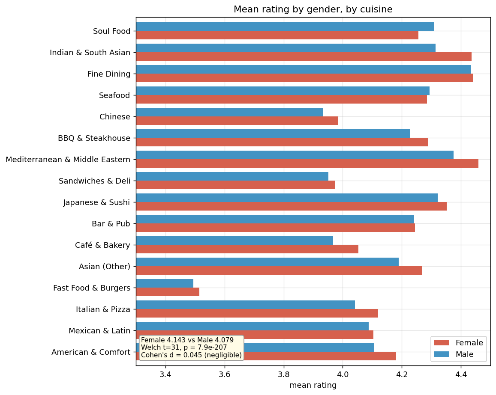

Slice the *same* ratings by **cuisine**, though, and they swing by nearly a full star:

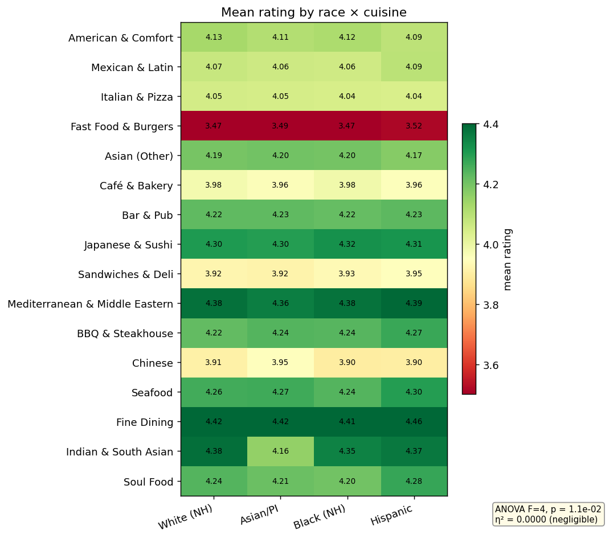

Read this heatmap by **row, not column**. *Across* columns (race) the numbers are nearly flat — the negligible effect again. *Down* rows (cuisine) they vary enormously: Fast Food & Burgers sits near 3.5 (deep red) while Bar & Pub and Asian restaurants hover around 4.3 (green). What drives a rating is overwhelmingly *what kind of place it is*, not *who's reviewing it*. Fine Dining (≈4.4), Mediterranean & Middle Eastern (≈4.4), and Indian & South Asian (≈4.3) top the list; Fast Food & Burgers (≈3.5), Chinese, Café & Bakery, and sandwich shops (≈3.9) anchor the bottom. A "4-star" fast-food spot and a "4-star" sushi bar are simply not the same bet — and a good model has to calibrate for that.

> *These cross-cuisine views use the LLM-inferred cuisine labels — 16 specific cuisines classified from each restaurant's reviews (see "What's out there" below for why we don't use Google's raw tags).*

### Who reviews which cuisines

Ratings barely move with demographics, but *who shows up* does shift by cuisine:

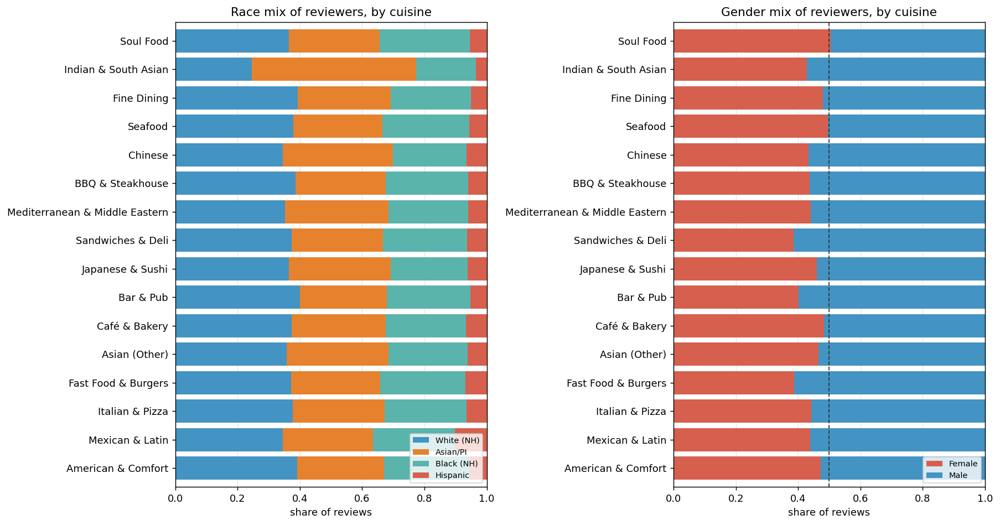

The compositions lean the way neighborhood demographics and dining habits would suggest: Mexican & Latin spots draw a noticeably larger Hispanic share, and Asian restaurants a larger Asian/Pacific-Islander share. On gender, bars, sandwich shops, and fast food skew male, while cafés and bakeries come closest to an even split. These are mild tilts, not hard splits — but they're real, and they're exactly the kind of structure a recommender can quietly inherit (something we test directly in Part 4).

### What's out there, and where

Finally, the catalogue itself — the full set of ~44,630 restaurants we discovered, before narrowing to the 18,879 that had reviews:

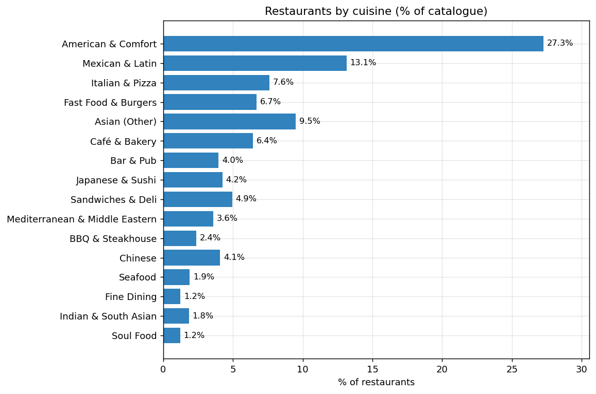

By share of that discovered catalogue, **American & Comfort dominates at 27%**, followed by Mexican & Latin (13%), Asian-other (10%), Italian (8%), fast food (7%) and cafés (6%); the long tail — Seafood, Indian, Fine Dining, Soul Food — is each ~1–2%. (Among only the *reviewed* restaurants the American & Comfort share is much lower, around 16% — the generic, unreviewed places skew heavily toward that catch-all category.)

A note on where these cuisine labels come from: **the LLM, not Google's raw place tags** — and for good reason. Google assigns a cuisine only when a place's "types" contain a recognizable token, and for ~19% of restaurants they don't. Most of those carry only a generic "restaurant" tag; others use categories the tag taxonomy never mapped (breakfast spots, salad and juice bars, vegetarian/vegan, halal, Caribbean, French); a few aren't restaurants at all (gas stations, grocery counters). Rather than dump all of them into a giant uncategorized "Other," we let the LLM read each restaurant's reviews and infer a specific cuisine — which is what every chart in this section uses. (Reassuringly, when we tested it, this cleaner labeling left model accuracy essentially unchanged — the cuisine signal was already implicit in who-visits-what — so it's purely an analysis improvement.)

And because we deliberately sampled the densest urban blocks, the restaurants concentrate in a handful of states — New York, California, Texas, and Florida lead — with cuisine mixes that echo local character: Texas and California carry a heavier Mexican share, while the Northeast tilts toward delis and bars.

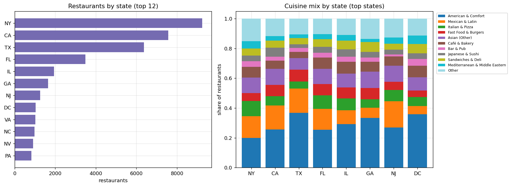

### How people write: review length and photos

The reviews themselves have a texture worth examining: how *much* people write, and whether they attach a photo, both vary in revealing ways.

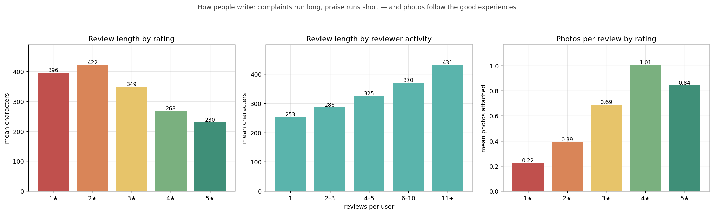

Two patterns run in opposite directions. **Length tracks dissatisfaction.** The most critical reviews are the longest — 1★ and 2★ reviews average about 400 and 420 characters, sliding down to roughly 230 for a 5★. A bad meal demands an explanation; a great one often gets "Amazing, will be back." Length also tracks **engagement**: one-time reviewers write ~250 characters, while the most active reviewers — the core we turn to next — write ~430, markedly more thorough. **Photos run the other way.** They peak on *positive* experiences — about one photo per 4★ review, with 38% carrying an image, versus barely 13% of 1★ reviews — because people photograph the meal they loved, not the one that let them down. Across the corpus, about 31% of reviews include at least one photo.

The practical upshot for Part 2: review length and photo attachment are cheap, informative signals of engagement and sentiment intensity — but because length is itself correlated with the star rating, text-derived features have to be built carefully, so they inform the model rather than quietly leak the rating back into it.

### Who reviews most — the active core (3+ reviews)

People review very unevenly, and the distribution is extreme:

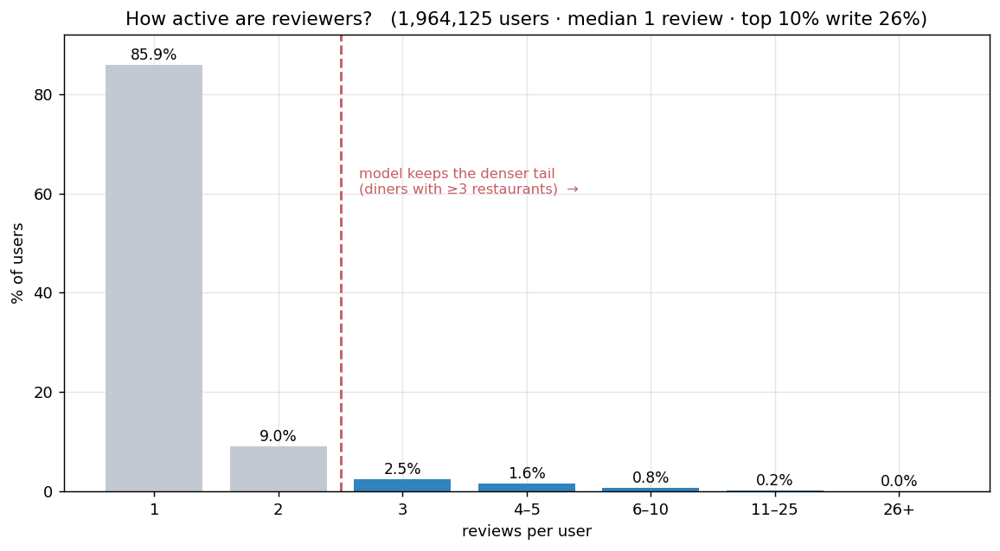

**86% of users leave just a single review** (the median is one), while the **top 10% of reviewers write 26% of all reviews**. That long tail is the central sparsity challenge — and it's why the model trains only on the denser core (the blue bars): diners with at least three distinct restaurants, who actually have a history to learn from.

Those active diners are a small but disproportionately active group — **99,777** people (5.1% of users) who wrote **18% of all reviews** — and they look different from the typical reviewer:

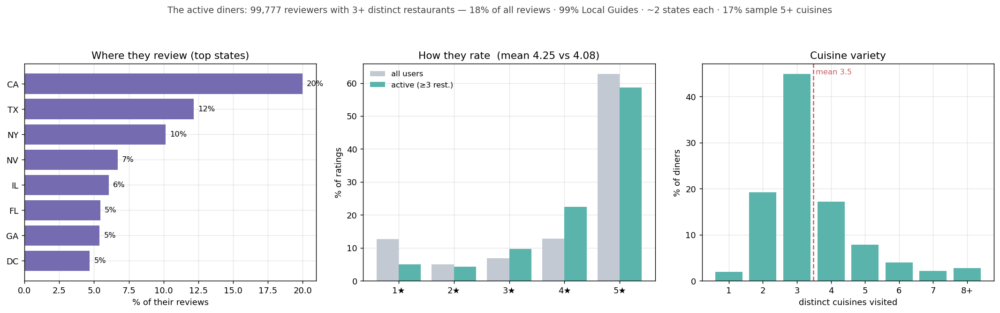

Almost all (**99%**) are Google Local Guides; they rate a touch more generously than average (**4.25** vs 4.08); they cluster in California, Texas and New York yet get around (~2 states each); and they lean toward **variety** — the typical one samples **3–4 distinct cuisines** (mean 3.5), about one in six tries five or more, and only ~2% stick to a single cuisine. They are exactly the engaged, mobile, variety-seeking diners a recommender has the best shot at serving — and because they want *variety*, simply serving more of their favourite cuisine would underwhelm.

### Why all this matters for the model

These shapes set up the rest of the series. The large cuisine-level rating gaps argue for features that capture *what a restaurant is* (Part 2); the geographic concentration is exactly why a location-aware model (Part 4) has so much to work with; and the sparse, variety-seeking active core is precisely who the model learns from.

---

## Step 5 — From tables to a graph

All this collection produced flat tables; the recommender, though, sees a **graph**. We assembled a heterogeneous graph of **2.5 million nodes and about 3 million edges** across five node types and four relations:

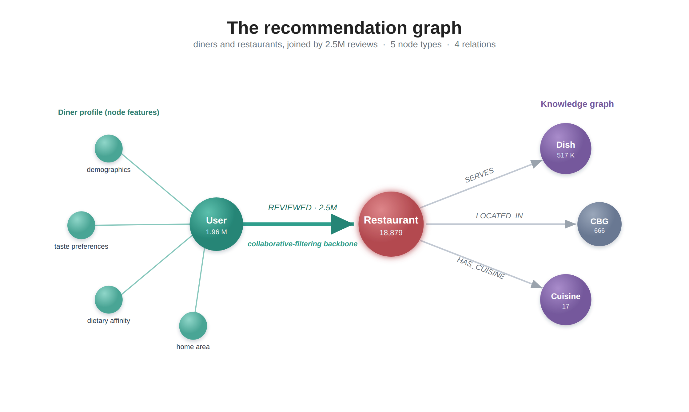

The structure is deliberate. The **REVIEWED** edges — 2.5 million of them — are the collaborative-filtering backbone: who liked what. The **SERVES / LOCATED_IN / HAS_CUISINE** edges form a **knowledge graph** that lets the model reason about *why* a restaurant might suit a user — its dishes, its neighborhood, its cuisine — not just who else reviewed it. Parts 3 and 4 lean heavily on that split.

### Defining the prediction task

Two choices shape every result that follows. We keep only users with **≥3 unique restaurants** (with one or two visits there's nothing to learn or to hold out), and we split **leave-one-out by recency** — each user's most recent visit becomes the test target, everything earlier is training. That mirrors the real task — *predict where they'll go next* — without leaking the future into the past. We score every model with **Precision@10, Recall@10, and NDCG@10**.

---

## Next steps

We now have a clean, geographically-grounded interaction graph — but the nodes are still thin. A restaurant is a name, a rating, and a price tier; a user is a bag of visits. The signal that makes this recommender interesting is locked inside **2.5 million reviews of free text**.

**Part 2** is about prying it out — using a locally-hosted 9-billion-parameter LLM to turn unstructured review prose into ~200 structured, interpretable features: dish-level flavor profiles, restaurant attributes (how spicy, how noisy, how formal), and user preference fingerprints. No cloud API, no black-box embeddings — and, as we'll see, a surprising lesson about *which* of those LLM features actually mattered.

---

## References

- W. Min, S. Jiang, L. Liu, Y. Rui, R. Jain. *A Survey on Food Computing.* ACM Computing Surveys, 2019. [arXiv:1808.07202](https://arxiv.org/pdf/1808.07202)
- C. Anderson. *A Survey of Food Recommenders.* 2018. [arXiv:1809.02862](https://arxiv.org/pdf/1809.02862)
- SafeGraph. *Your Guide to Foot Traffic Data* (Patterns methodology). [safegraph.com](https://www.safegraph.com/data-categories/foot-traffic-data)
- *Understanding the bias of mobile location data across spatial scales and over time: A comprehensive analysis of SafeGraph data in the United States.* [PMC10798630](https://www.ncbi.nlm.nih.gov/pmc/articles/PMC10798630/)
- Uber Engineering. *H3: Uber's Hexagonal Hierarchical Spatial Index.* [uber.com/blog/h3](https://www.uber.com/blog/h3/) · [github.com/uber/h3](https://github.com/uber/h3) · [h3geo.org](https://h3geo.org/)

---

### Appendix: the canonical-data note

Numbers in this series come from the **unextended** dataset (the 666-CBG / 18,879-restaurant / 2.5M-review graph above). All EDA in this part is computed on that canonical set.

A note on the review count. The scraper, run in repeated passes, captured each review several times, so the raw interaction graph holds ~10 million REVIEWED *edges* but only **~2.5 million distinct reviews** (every review appears about four times). We report the distinct-review count throughout. The training and evaluation pipeline deduplicates interactions to one row per (reviewer, restaurant) before building the adjacency or sampling, so the duplication does not affect any model result; it only inflates raw edge counts. A separate attempt to expand the review corpus degraded model quality and is excluded from all reported results; see `RECONCILIATION.md` for the full provenance trail.
