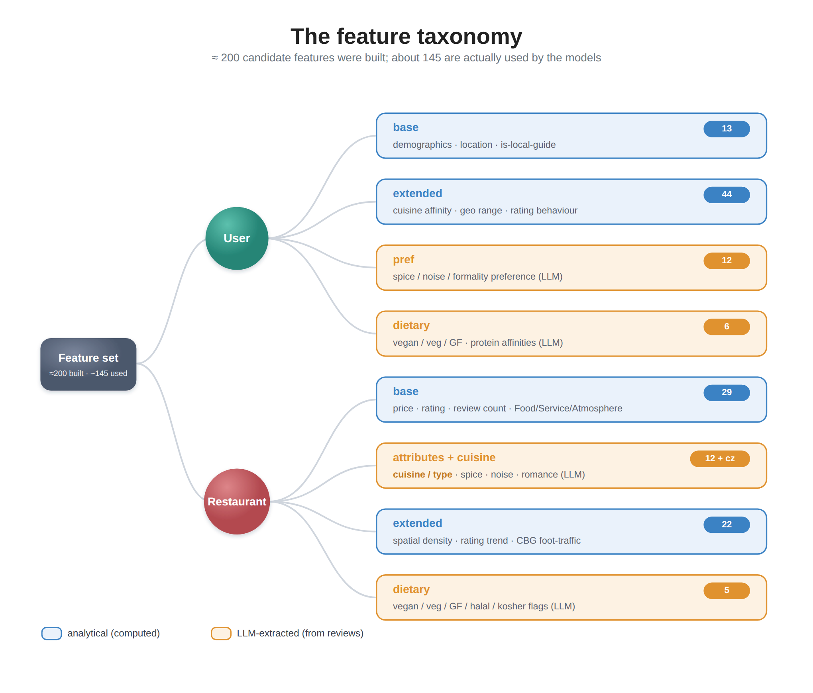

# Part 2 — Feature Engineering: With and Without an LLM

*Two complementary ways to enrich a graph — deterministic analytics computed from the data we already had, and semantic features mined from review text by a locally-hosted language model — and a tour of the more creative features in each.*

> **Series:** *Building a restaurant recommender from 2.5M Google reviews — graphs, local LLMs, and geography.* Part 2 of 4. ([Part 1: Data & Collection](ARTICLE_PART1_DATA_COLLECTION.md).)

---

## Thin nodes

At the end of Part 1 we had a graph: 1.96M reviewers, 18,879 restaurants, 517K dishes, wired together by 2.5M reviews. But the *nodes* were thin. A restaurant was a name, a star rating, and a price tier; a user was a bag of visits. A collaborative-filtering model can do a surprising amount with just the interaction edges — but the signal that separates "this place is popular" from "this place suits *you*" was still locked in two places: the **structured metadata** we'd collected, and the **2.5 million reviews of free text** we hadn't yet read.

So we built features along two complementary tracks:

1. **Analytical features** — computed deterministically from structured data and behavioral aggregates. Cheap, reproducible, interpretable. No model in the loop.
2. **LLM-extracted features** — semantic attributes mined from unstructured review prose by a locally-hosted language model.

Both tracks earn their place, and the most useful features are often the least glamorous ones. This post walks through the more creative ideas in each track. Which features moved the needle most is a question we answer with ablations in Part 4 — here, the focus is on *how you build them.*

The pipeline produced north of 200 candidate features across users, restaurants, and dishes. Every one belongs to a named **group**, on either the user or the item (restaurant) side — and the grouping isn't cosmetic. It's what lets us later switch whole families of features on and off to see what each is worth.

| Side | Group | Source | Track |
|---|---|---|---|
| **User** | `base` | reviewer metadata + inferred demographics | analytical |
| | `extended` | behavioral & geographic aggregates | analytical |
| | `pref` | preference fingerprint from review text | LLM |
| | `dietary` | vegan / veg / GF + protein affinities | LLM |
| **Item** | `base` | Places metadata + review sub-scores + cuisine | analytical |
| | `nlp` | scored attributes (spice, noise, formality…) | LLM |
| | `extended` | dish diversity, spatial density, review dynamics, CBG foot-traffic | analytical |
| | `dietary` | vegan / veg / GF / halal / kosher flags | LLM |

---

## Track 1 — Analytical features (no model required)

These are the workhorses: deterministic functions of data we already had. Unglamorous, but they carry a large share of the signal — as Part 4's ablation will show — and several are more inventive than they first appear.

### Base features

The cheapest signal, straight from metadata: normalized price, average rating, location, cuisine, and — usefully — the **Food / Service / Atmosphere sub-scores** Google attaches to reviews. That last split matters more than it looks: two restaurants can both average 4.0 overall, but one is a "great food, slow service" spot and the other a "gorgeous room, average plates" spot. A single star rating erases that distinction; the sub-scores keep it.

On the user side: is-local-guide, review volume, location, and the inferred race/gender signals from Part 1 — used both as features and, later, as fairness slices.

### Extended behavioral & spatial features

This is where deterministic feature engineering does most of its work. On the **user** side we summarize *how* and *where* someone eats:

- **Cuisine affinity + entropy.** A 17-way affinity vector, plus its entropy. The entropy is the creative bit: a user whose every review is ramen and izakaya scores *low* (a specialist who wants depth in one cuisine), while someone bouncing between tacos, sushi, BBQ, and bistros scores *high* (a variety-seeker). Same number of visits, very different person to recommend to.
- **Geographic range.** How far someone roams: distinct CBGs / tracts / counties reviewed, mean distance from their home block. A homebody who never leaves a one-mile radius needs very different candidates than a road-warrior reviewing across 30 counties.
- **Rating behavior.** Pickiness, variance, share of 5-star vs 1-star. A user who hands out 5 stars to everything carries less information per rating than a tough grader — and the model can learn to weight them differently.

On the **item** side, we capture a restaurant's *context*, not just its contents:

- **Spatial density via a nearest-neighbor (BallTree) search.** How many restaurants — and how many *same-cuisine* competitors — sit within 500 m and 2 km. A lone taquería on a rural highway has no substitutes; one of 25 taquerías in a dense LA corridor competes for every visit. "Good" should mean something different in each setting.
- **Review dynamics.** Not just the average rating, but its **trajectory**. Two restaurants both average 4.2 — but one is sliding (recent reviews around 3.8) and one is climbing (recent 4.6). We fit a simple slope over time to capture the trend the average hides, alongside review velocity and recency.
- **CBG foot-traffic rhythm.** Here Part 1 pays off directly. From the SafeGraph neighborhood data we attach each restaurant's *temporal signature*: its weekend / lunch / evening / late-night visit ratios and visitor-origin diversity. A late-night-skewed block in a tourist corridor behaves nothing like a lunch-dominated office district — and that context shapes who a restaurant is *for*.

---

## Track 2 — LLM-extracted features (from review text)

Now the text. The 2.5 million reviews hold exactly the qualitative signal that ratings flatten away: *is this place romantic or rowdy? authentic or Americanized? what should I actually order?* We extracted that with a language model run **locally** — no cloud API — because we made hundreds of thousands of calls and wanted to keep both the cost and the (public, but personal) review text on our own hardware.

The one technique worth borrowing here is **structured output**: we asked the model to return strict JSON matching a fixed schema, rather than free prose, and ran it deterministically. That turns "an LLM read some reviews" into a clean, typed feature column you can join like any other — the difference between a research toy and a pipeline.

### Restaurant attributes (`item.nlp`)

For each restaurant we picked its most informative reviews and asked the model to score **12 attributes on a 0–1 scale**: spice level, noise level, formality, novelty, family-friendliness, romance, wait time, value for money, outdoor seating, healthy options, bar scene, portion size.

The trick that made these stable was an **anchoring guide** in the prompt — concrete descriptions of what 0 and 1 *mean* for each attribute, e.g. *"noise: 0 = dead quiet, fine for a phone call; 1 = you have to shout to be heard."* Without anchors, the model invents a fresh scale for every restaurant and the numbers aren't comparable. With them, a 0.8 noise score means the same thing everywhere.

> [FIGURE: an example review excerpt and the JSON attribute scores the model returns for it.]

### Dishes as first-class entities

This is the part that directly tackles the **dish-level gap** from Part 1. Standard restaurant recommenders never model dishes; we made them graph nodes.

We identified the dishes people actually mention — using a deliberately strict prompt with a *negative list* that excludes bare proteins ("chicken"), condiments, and generic words ("food", "lunch"), so we capture *dishes* ("chicken tikka masala") and not noise — and combined that with Google's own "recommended dishes" data. The result is the dish layer of the graph: the **517K dish nodes** and their `SERVES` edges from Part 1.

Then, instead of reaching for an off-the-shelf text embedding, we did something more interpretable: we asked the model for a **structured flavor profile** per dish — its category, cuisine, primary protein, cooking method, and one to three flavor notes — and turned that into a compact vector. Similarity between those vectors gives a dish-similarity graph where the matches are *explainable*: a search near "pad thai" surfaces "drunken noodles" (same cuisine, same wok method, shared flavors), and "birria tacos" sits next to "barbacoa" and "carnitas" (same cuisine, same braised-meat method). You can read *why* two dishes are neighbors straight off the vector — which an opaque embedding never lets you do.

> [FIGURE: one dish's decoded flavor profile and its nearest neighbors.]

### User preference fingerprints (`user.pref`)

One feature-design idea proved especially useful here: **symmetry**. We ran the *same* 12-attribute schema over each **user's own reviews** to build a preference fingerprint — spice affinity, noise preference, formality, novelty-seeking, value sensitivity, and so on. Because the user and restaurant attribute spaces are aligned one-to-one, the model can reason about *fit*, not just co-visitation. A user who keeps raving about quiet, candle-lit rooms scores high on formality and romance and low on noise — so we can steer them toward the right room and away from the popular sports bar, even if everyone else is at the sports bar.

### Dietary preferences — a symmetric matching feature

The same symmetry idea, applied to diet, yields one of the more useful features in the pipeline. On the **restaurant** side we flag whether a place has strong **vegan / vegetarian / gluten-free / halal / kosher** options. On the **user** side we mine **dietary affinities** from review text: a reviewer who keeps praising the cauliflower wings, the oat-milk latte, and the jackfruit tacos builds a high *vegan affinity* (we also capture seafood / red-meat / poultry leanings the same way). Match the two and you get genuinely useful behavior — surfacing strong-vegan-option restaurants to a plant-leaning diner — that a venue's star rating could never express.

### Higher-order semantic scores

Because structured extraction is cheap to extend, we also experimented with more abstract attributes: an **authenticity score**, and **occasion fit** — is this a date-night place, a business-lunch spot, a family outing, a solo bite? These are the kind of judgments only a reader of the reviews can make, and they hint at how far this approach can be pushed. (We'll see in Part 4 which of all these scores actually earned their keep.)

---

## Assembling it all

A final step joins every source into two wide matrices — one for users, one for restaurants — plus the group map the trainer reads. One small but important detail: **how we fill the gaps encodes a prior.** A missing analytical feature fills to `0.0`, but a missing *preference or attribute score* fills to **`0.5`** — neutral on a 0–1 scale, so "we don't know how spicy this place is" doesn't get silently recorded as "definitely not spicy."

The group structure is also what powers the experiments in Part 4: because every feature is tagged with its group, we can retrain with any family removed — no LLM gives us, all NLP scores out, demographics out — and read off exactly what each is worth.

---

## Design lessons

A few principles emerged from building all of this — useful whether or not you have a restaurant graph:

- **Score users and items on the same axes.** Using the *same* 0–1 attribute schema for both turns recommendation into a tractable question of *fit*. This was the single most useful structural decision.
- **Anchor LLM scores with concrete definitions.** A score is only a feature if it means the same thing across rows. Explicit 0-and-1 definitions in the prompt did more for quality than any model choice.
- **Favor structured, interpretable representations over opaque embeddings.** The hand-built dish flavor vectors gave us explainable similarity at a fraction of the complexity of black-box embeddings.
- **Cheap deterministic analytics carry real signal.** Entropy, spatial density, a rating *slope* — none of these need a model, and the Part 4 ablation shows they did much of the work.

Exactly how much signal each family carries — and which of our fancier LLM scores survived contact with the data — is the subject of Part 4.

---

## Next steps

We now have a richly-featured heterogeneous graph: users and restaurants each carrying dozens of features, dishes carrying interpretable flavor vectors, all stitched together by 2.5M reviews and a knowledge graph of cuisines, dishes, and neighborhoods.

**Part 3** brings in the architecture. We benchmark a range of graph-neural-network recommenders — from LightGCN to knowledge-graph attention (KGAT) — reimplement six recent papers, and build a custom hybrid that fuses knowledge-graph attention with contrastive learning. Then **Part 4** turns to the results, including the finding that a simple geographic re-ranking outperformed every architectural refinement.

---

## References

- W. Min, S. Jiang, L. Liu, Y. Rui, R. Jain. *A Survey on Food Computing.* ACM Computing Surveys, 2019. [arXiv:1808.07202](https://arxiv.org/pdf/1808.07202)
- Qwen open-weights model family — [Qwen on Hugging Face](https://huggingface.co/Qwen)
- Uber H3 (neighborhood / spatial features) — [h3geo.org](https://h3geo.org/)

---

### Appendix: the canonical-data note

All model numbers referenced in this series come from the **unextended** dataset; see `RECONCILIATION.md` for provenance.
