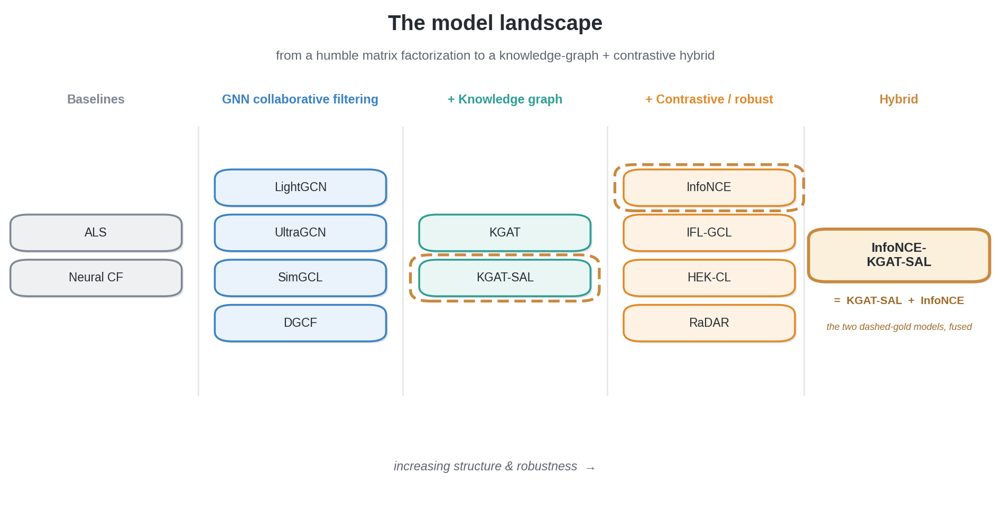
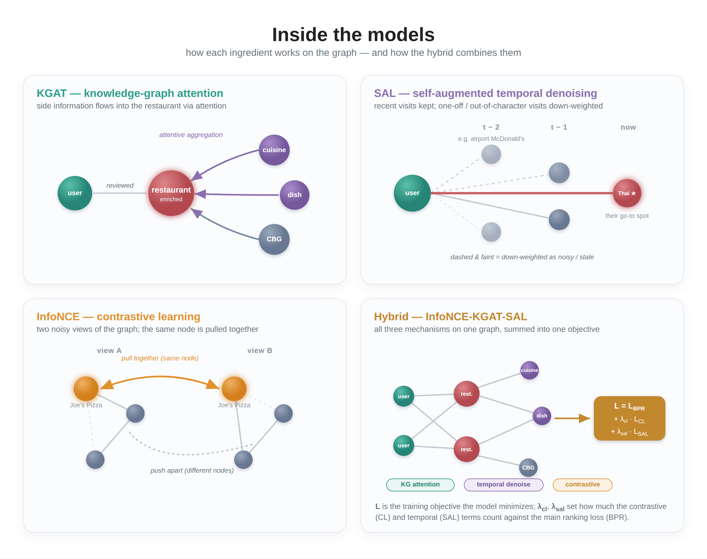

# Part 3 — Graph Recommender Architectures: From LightGCN to a Custom Hybrid

*Turning a featured graph into "where will they go next" — a survey of graph-neural-network recommenders, six recent papers reimplemented, and a hybrid that fuses knowledge-graph attention with contrastive learning.*

> **Series:** *Building a restaurant recommender from 2.5M Google reviews — graphs, local LLMs, and geography.* Part 3 of 4. ([Part 1](ARTICLE_PART1_DATA_COLLECTION.md) · [Part 2](ARTICLE_PART2_FEATURE_ENGINEERING.md))

---

## The prediction task: ranking, not rating

A common misconception about recommenders is that they predict a star rating. Ours doesn't. The job is to **rank** — out of ~19,000 restaurants, surface the handful a particular diner will actually visit next. We treat each review as **implicit positive feedback** (they showed up, so they were interested) and train every model with a *ranking* objective: score a place the diner visited above one they didn't. At evaluation we ask the blunt question from Part 1 — *was the restaurant they actually visited next in our top 10?*

The features from Part 2 don't sit on the sidelines: each model starts from those user and restaurant feature vectors and refines them as it learns. The interesting question this part answers is **what architecture does the refining** — and whether the fancy ones are worth it.

---

## Baselines: non-graph models

Before reaching for graph neural networks, you need a yardstick.

- **Matrix factorization (ALS)** is the classic move: arrange every diner-visited-restaurant pair into a giant sparse matrix and factor it into compact "taste" vectors for users and restaurants. No graph, no review text — just who-visited-what. If a GNN can't beat this, the complexity isn't earning its keep.
- **Neural collaborative filtering** swaps the dot-product for a small neural network over the same embeddings — a little more flexible, still no graph.

These set the bar. Everything that follows is an argument for why structure helps.

## Graph-based collaborative filtering

The core idea of a graph recommender is almost folk wisdom: **a diner's taste is defined by the places they go, and a place's character by who goes there.** A graph neural network makes that literal. Information flows along the review edges in rounds ("message passing"): after one round, your embedding has absorbed the restaurants you've visited; after two, the *other* diners who visit those restaurants; after three, *their* favorites. Stack a few rounds and a diner who loves three ramen shops drifts, in embedding space, toward the broader ramen-loving crowd — and toward ramen places they haven't tried yet.

- **LightGCN** is the workhorse. Its insight was subtractive: throw away the heavy transformations earlier graph models inherited from other domains and keep *only* neighbor averaging. Simpler, faster, and a stronger recommender. It's our reference point.
- **UltraGCN** notices that stacking message-passing rounds is expensive and instead approximates "infinitely many rounds" with a clever training constraint — much faster, similar spirit.
- **SimGCL** adds a contrastive twist (more on that below): nudge the graph with a little random noise twice, and train the model to recognize the two noisy versions as the same place. It spreads embeddings out and resists over-popular items dominating.
- **DGCF** disentangles *intent*: you might visit one restaurant for a quick weekday lunch and another for a date, so it splits each embedding into separate intent channels.

## Adding a knowledge graph: KGAT

LightGCN only knows the review edges — it's blind to *why* two restaurants are similar. But Part 1 handed us a **knowledge graph**: restaurants link to the dishes they serve, the cuisine they belong to, and the neighborhood they sit in. **KGAT** (Knowledge Graph Attention Network) propagates over the review edges *and* those knowledge edges together, using attention to learn which connections matter.

The payoff is concrete. Suppose you've loved several pad-thai-and-drunken-noodle spots. A pure collaborative model can only recommend a new Thai place once enough *other* people have linked it to your crowd. KGAT can route through the shared **dish** and **cuisine** nodes and surface it immediately — even with almost no reviews. That's a direct attack on the cold-start problem.

- **KGAT-SAL** goes further with "self-augmented learning" (borrowed from the *Self-GNN* paper): it splits each diner's history into time periods and learns to **denoise** them — recognizing that tastes drift and that a one-off airport-McDonald's visit shouldn't define you. A stability weighting quietly down-weights the noisy, out-of-character visits.

## Contrastive and robustness models from the literature

Recent recommender research is full of self-supervised and robustness ideas, and we reimplemented six recent papers to see whether they'd transfer to messy, real-world review data:

| Paper (idea) | What it does | Our model |
|---|---|---|
| **INFONCE-GCL** — Wang et al., 2025 [1] | Reframes contrastive learning as a positive-unlabeled problem, mining *true* positive pairs instead of trusting random ones | IFL-GCL (and a KG-aware variant) |
| **RaDAR** — Huang et al., 2026 [2] | Diffusion-style denoising plus asymmetric negative sampling for sparse, noisy graphs | RaDAR |
| **HEK-CL** — Yuan et al., 2024 [3] | Embeds nodes in *hyperbolic* (curved) space — a natural fit for hierarchy — with denoising and a robust contrastive loss | HEK-CL (and a hyperbolic-loss SimGCL) |
| **Self-GNN** — Liu et al., 2024 [4] | Combines short-term and long-term behavior with self-augmented denoising | the SAL component of KGAT-SAL |
| **HGNN-AR** — Lin et al., 2025 [5] | Adaptively *rebuilds* missing graph edges to fix connection gaps | KG edge refinement in the hybrid |
| **LIT-GRAPH GCN** — Gelal et al., 2025 [6] | Shows deep relational embeddings beat shallow ones on knowledge graphs | the relational rationale behind KGAT |

**Contrastive learning, in one sentence:** make two slightly-perturbed views of the graph and train the model to recognize that a given diner (or restaurant) is "the same" across both views. It pulls meaningful things together, pushes unrelated things apart, and — crucially for a long-tail dataset — stops a handful of mega-popular restaurants from swallowing the embedding space.

## The custom hybrid: combining the knowledge graph with contrastive learning

Each family above has a different strength: KGAT-SAL brings the knowledge graph and temporal denoising; contrastive methods bring robustness and well-spread embeddings. So we built a **hybrid — InfoNCE-KGAT-SAL** — that runs a contrastive objective *on top of* the KGAT-SAL knowledge-graph backbone, getting both at once.

The figure below sketches the three ideas the hybrid combines — KGAT's knowledge-graph attention, SAL's temporal denoising, and InfoNCE's contrastive learning — and how they roll up into a single training objective.

Getting it to train well took one nice debugging story. A pure contrastive objective **plateaued**: once it had pulled every matching diner-restaurant pair together, the remaining negatives were all easy, produced almost no gradient, and learning stalled. Three changes fixed it: keep a **ranking objective** running alongside the contrastive one so there's always a useful signal; **mine hard negatives** (restaurants that look similar to a diner's favorites but that they didn't choose — the genuinely informative mistakes); and gradually **sharpen** the contrastive objective over training rather than starting it at full strength.

Whether all this machinery actually paid off is Part 4's subject — and the answer is sobering: the gaps between these models turned out to be small, and a simple geographic re-ranking outperformed every one of them.

---

## Which architectures fit this problem?

Benchmarks aside, it's worth asking *why* some families suit restaurant recommendation and others don't — because this scenario has a particular shape. The signal is **extremely sparse** (2.5M reviews spread over ~2M diners and ~19K restaurants, with a long tail of one-or-two-review users and restaurants), the feedback is **implicit and noisy** (a visit isn't an endorsement; some visits are one-off or occasion-driven), and — the theme of Part 4 — behavior is **intensely local.**

- **Matrix factorization and neural CF** are honest baselines but structurally limited here: with no side information and no message passing, they have nothing to fall back on for a restaurant with five reviews. They drown in the sparsity.
- **LightGCN / UltraGCN** help precisely *because* propagation lets a sparse node borrow signal from its neighbors — a real fit for this data. But pure collaborative filtering still can't speak to a brand-new restaurant, and it tends to **amplify popularity bias** (a problem we measure in Part 4).
- **Contrastive methods (SimGCL, InfoNCE, IFL-GCL)** are, in principle, well-suited to a long-tail catalog: spreading embeddings out counters the pull of mega-popular items. In practice they were **finicky** — pure InfoNCE plateaued and some variants collapsed — so the benefit came only with careful tuning.
- **Hyperbolic embeddings (HEK-CL)** are theoretically appealing for hierarchical structure (cuisines contain sub-cuisines contain dishes), but were the hardest to train and underperformed on our messy real-world data — an elegant idea that didn't pay off here.
- **Disentangled intent (DGCF)** captures something true — a diner has a lunch self and a date-night self — but separating those intents from sparse implicit signals proved hard, and the payoff was modest.
- **Knowledge-graph models (KGAT)** are the best conceptual fit, and the leaderboard agreed. The dish/cuisine/neighborhood side information directly attacks the cold-start problem: a new ramen shop can be recommended through the *dishes it serves*, before anyone has reviewed it. That's the one thing pure CF cannot do, and it's exactly what this long-tail, high-turnover domain needs. **KGAT-SAL**'s temporal denoising further targets the noisy, occasion-driven visits.

The meta-lesson sets up Part 4: the architectures that helped most were the ones that **injected structure the interactions alone couldn't provide** (the knowledge graph). And even the best of them was about to be outdone by something none of them modeled — *where the diner actually is.*

## Next steps

We have more than a dozen trained models, from a humble matrix factorization to a knowledge-graph-plus-contrastive hybrid. **Part 4** puts numbers on all of them and develops the central finding of the series: **geography beats architecture.** A single spatial re-ranking step lifts precision sharply across every model, outweighing the differences between them. We'll also look at *where* the recommender works, *who* it works for, and the popularity bias in its recommendations.

---

## References

1. Z. Wang, B. Xu, Y. Yuan, et al. *InfoNCE is a Free Lunch for Semantically Guided Graph Contrastive Learning.* arXiv:2505.06282, 2025. [arxiv.org/abs/2505.06282](https://arxiv.org/abs/2505.06282)
2. Y. Huang, J. Chen, S. Zhang, Z. Cao. *RaDAR: Relation-aware Diffusion-Asymmetric Graph Contrastive Learning for Recommendation.* arXiv:2603.16800, 2026. [arxiv.org/abs/2603.16800](https://arxiv.org/abs/2603.16800)
3. M. Yuan, Z. Zhang, W. Chen, C. Zhao, T. Cai, D. Wang, R. Liu, F. Zhuang. *HEK-CL: Hierarchical Enhanced Knowledge-Aware Contrastive Learning for Recommendation.* Beihang University, 2024.
4. Y. Liu, L. Xia, C. Huang. *SelfGNN: Self-Supervised Graph Neural Networks for Sequential Recommendation.* SIGIR, 2024.
5. W. Lin, Z. Chen, Y. Chen, S. Wang. *Heterogeneous Graph Neural Network with Adaptive Relation Reconstruction.* Neural Networks 187:107313, 2025.
6. N. Gelal, C. Snow, K. M. Jagodnik, A. Rios, H. Küçük McGinty. *LIT-GRAPH: Evaluating Deep vs. Shallow Graph Embeddings for High-Quality Text Recommendation in Domain-Specific Knowledge Graphs.* Kansas State University, 2025.

---

### Appendix: the canonical-data note

All model numbers in this series come from the **unextended** dataset (the graph from Part 1, embedding dimension 2048). See `RECONCILIATION.md` for provenance.
