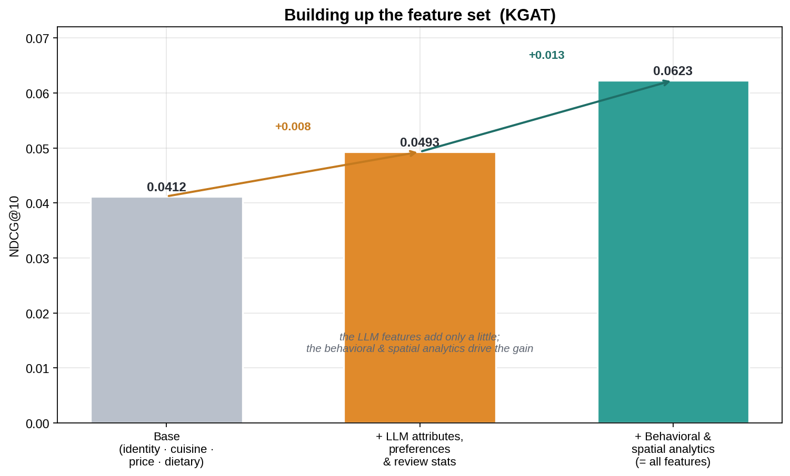
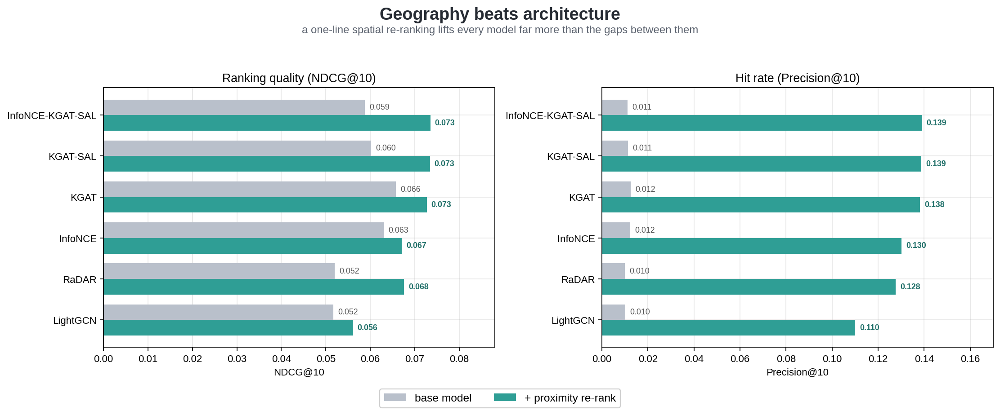
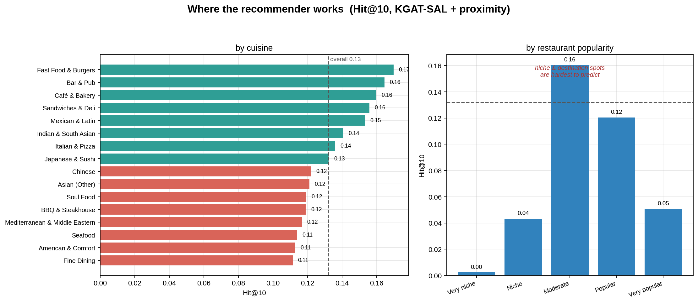
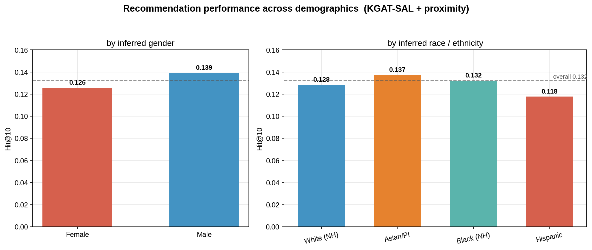
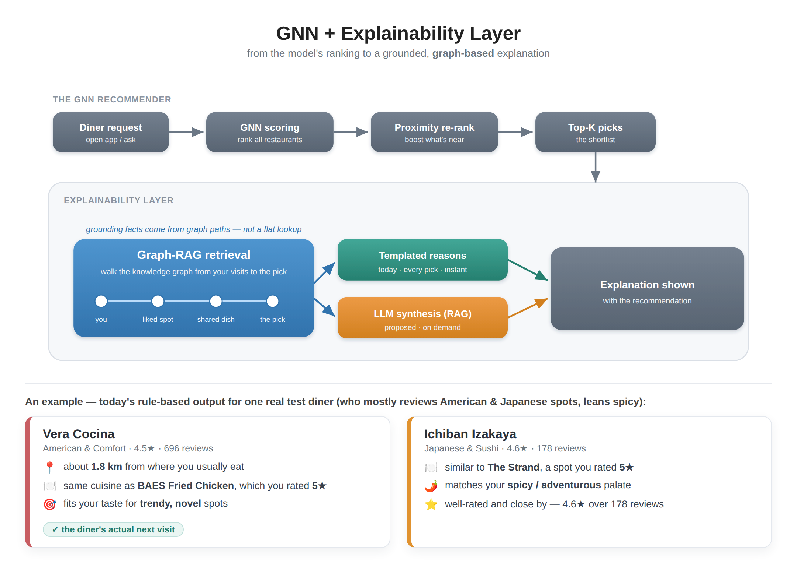

# Part 4 — Results: Geography, Fairness, and the Limits of Architecture

*Results for a dozen models, a feature-ablation study, and a spatial re-ranking step that improved every model more than any architectural change did — followed by where the recommender works, who it serves, and a popularity bias in what it surfaces.*

> **Series:** *Building a restaurant recommender from 2.5M Google reviews — graphs, local LLMs, and geography.* Part 4 of 4. ([Part 1](ARTICLE_PART1_DATA_COLLECTION.md) · [Part 2](ARTICLE_PART2_FEATURE_ENGINEERING.md) · [Part 3](ARTICLE_PART3_MODEL_ARCHITECTURES.md))

---

## The leaderboard

Part 3 built up a dozen architectures; this is how they actually ranked restaurants. Each model is scored by NDCG@10 — how highly the diner's true next visit lands in the top ten — and Recall@10 — whether it appears there at all, evaluated on each user's held-out most-recent visit.

| Model | NDCG@10 | Recall@10 |
|---|---|---|
| KGAT | **0.0658** | 0.1243 |
| InfoNCE | 0.0631 | 0.1230 |
| KGAT-SAL | 0.0602 | 0.1136 |
| InfoNCE-KGAT-SAL (hybrid) | 0.0588 | 0.1107 |
| SimGCL | 0.0536 | 0.1015 |
| RaDAR | 0.0520 | 0.0987 |
| LightGCN | 0.0517 | 0.1005 |

Two things stand out, and the first is a mild surprise: how *tight* the field is. The entire lineup, from plain LightGCN to the knowledge-graph-plus-contrastive hybrid, fits inside a band of roughly 0.05–0.066 NDCG. The knowledge graph earns its place — KGAT is the strongest single model and sits clearly above LightGCN — but the contrastive objectives, and even our own custom hybrid, never quite overtake a well-tuned KGAT at the base ranking task.

The second is what that tightness implies. On this problem, architectural sophistication bought less accuracy than the model-comparison literature would lead you to expect. It's worth sitting with that, because the rest of Part 4 is really an account of where the accuracy *did* come from — and it wasn't the architecture.

## Which feature families mattered?

Part 2 deferred a question it couldn't yet answer: which feature families actually move the metric? The test is a build-up ablation — retrain the same model (KGAT) from a bare base, add one family at a time, and watch NDCG@10.

From a base of identity, cuisine, price, and dietary flags, NDCG@10 is 0.041. Adding the entire LLM-derived layer — the scored taste attributes, the user preference fingerprints, and the review statistics — raises it to 0.049, a gain of 0.008. Adding the behavioral and spatial analytics — cuisine-affinity vectors, geographic range, spatial density, neighborhood foot-traffic, rating dynamics — raises it to 0.062, a further 0.013. The deterministic analytics, in other words, contribute more than the entire LLM feature layer. One detail cuts the same way: the six review-statistic features (rating variance, photo rate, repeat-visitor rate, and the like) are marginal enough that dropping them nudges the full model up to 0.066 — well within noise.

This is the counterweight to the LLM feature engineering in Part 2. The semantically rich signals are not worthless: the LLM-scored taste attributes and the dish layer contribute through the knowledge-graph and contrastive pathways. But the plainer deterministic analytics — where a diner goes, how far they range, how a neighborhood behaves — did most of the work. The lesson recurs throughout the project: spend effort where the signal is, and don't assume the expensive features are the valuable ones.

## Geography versus architecture: a proximity re-ranking

People eat near where they live and work. It is the most basic fact about dining, and none of the models above used it directly — they learned from *who reviews what*, not *where anything is*. So we added a post-processing step, applied to any model's ranked output, with no retraining:

1. Estimate each diner's "home base" as the typical location of the restaurants they have already reviewed.
2. Re-rank the model's top candidates by blending the model score with a distance term, so closer restaurants are boosted.

Two parameters control it: the weight on distance relative to the model's own score, and how quickly the distance boost decays (a few kilometers versus a wider metro radius). A small grid search set both per model — generally a moderate-to-strong distance weight with a 5–20 km radius.

The effect is large:

NDCG@10 rises by about 0.01 across every model, and Precision@10 rises from roughly 0.012 to about 0.14 — a more than tenfold increase. The mechanism is straightforward: a diner's next visit is overwhelmingly close to their existing haunts, so boosting by proximity discards thousands of geographically implausible candidates and concentrates the top ten where the answer tends to be.

The comparison with the architecture work is the part worth dwelling on. That single proximity step lifts every model by more than the entire spread between LightGCN and the hybrid — and once it's applied, the models all but converge at the top: the hybrid leads at 0.0735, KGAT-SAL at 0.0734, KGAT at 0.0727, a difference too small to call. Put bluntly, months of architectural iteration moved NDCG by a few thousandths, while one inductive bias about local dining moved precision by an order of magnitude. The generalizable point: before reaching for a more elaborate model, account for the domain signal the current one is ignoring.

## Where it works, and where it struggles

Anchoring on a strong proximity-reranked model, the overall hit rate — the top ten contains the next visit — is about 13%. That average hides wide variation, and the variation is where the model's character shows.

The model predicts everyday, habitual places best. Inexpensive restaurants (hit rate ~18%), fast food and burgers (~17%), and bars, cafés, and sandwich shops (~16%) lead the list. These are the places people return to without much deliberation — repeat, local, routine — which is exactly the pattern collaborative filtering captures well.

It struggles with the special and the singular. Niche restaurants with few reviews fall to ~2%, where there is too little signal to work with. So do the very popular destinations (~5%) and the highest-rated, 4.6-plus places (~9%). The reading is intuitive: a regular taco lunch is predictable, while a once-a-year fine-dining choice is nearly the opposite, because occasion dining isn't habitual.

## A popularity bias in the recommendations

A recommender can be accurate on average while steering everyone toward the same well-known places, and this one does. The most-reviewed quartile of restaurants accounts for about half of all recommendations despite being a quarter of the catalog, while the least-reviewed quartile is almost absent — well under 1% of recommendations.

This is the project's real equity issue, and it concerns restaurants rather than diners. Small, new, and niche places are structurally disadvantaged by a system that learns from review volume — a feedback loop that can entrench popular venues and starve the long tail. It is a well-documented failure mode of collaborative filtering, and worth stating directly rather than leaving implicit.

## Who it works for

Part 1 framed fairness in terms of how groups *rate*; the question here is how well the recommender *serves* them.

The gaps are modest but present. By gender, men are served slightly better than women (13.9% vs 12.6% hit rate). By inferred race, Asian/Pacific-Islander diners fare best (13.7%) and Hispanic diners worst (11.8%), with White and Black diners near the 13.2% overall. None of these is large, and the Hispanic shortfall tracks the data: Hispanic reviewers were the smallest classified group in Part 1 (~7%), so the model has the least of their behavior to learn from. The widest gap is by *engagement* rather than identity — highly active "local guide" reviewers are served better than casual ones, simply because they bring more history.

So the main fairness concern here is not demographic disparity, which is small, but the popularity bias above, which disadvantages restaurants rather than people. The distinction matters for mitigation: it points the effort toward exposure and cold-start handling, and toward thinner-data groups, rather than toward demographic calibration.

## Why this restaurant? An explainability layer

A ranked list is more useful when it can say *why*. On top of the recommendations we built a lightweight **explainability layer** that turns each pick into plain-language reasons grounded in the diner's own history, drawing on the same signals the model implicitly balances: **proximity** to where they usually eat, **cuisine affinity**, alignment with their **taste profile** (the LLM-derived preferences from Part 2), and the restaurant's **quality**.

The diagram below sketches the proposed end-to-end design — from the GNN's ranking, through the explainability layer, to the explanation a diner sees — alongside a real example of today's output:

The reasons read naturally: *near where you usually eat · same cuisine as a place you rated 5★ · fits your taste for adventurous spots · well-rated.* When a recommendation happens to be the diner's actual held-out next visit — as the first card was — the explanation reads as a convincing account of the choice. These are **post-hoc** explanations: they rationalize the ranking rather than expose the model's internals. But every reason is checkable against the diner's own data, which is what keeps them honest. Today the wording is templated, and the cards above are real outputs of that rule-based layer (full examples in the companion `explainability_examples.md`).

### Why retrieval here is *Graph*-RAG

The retrieval step in the diagram is deliberately a graph walk rather than a flat fact lookup, and that is where its value lies. The "why" we want to surface is, structurally, *a path through the recommendation graph*: the candidate connects back to the diner through a **shared dish**, a **shared cuisine**, a **nearby neighbourhood (CBG)**, or a **similar diner** a couple of hops away. Walking the knowledge graph from the diner's reviewed restaurants to the candidate retrieves exactly those connecting paths, so each grounding fact arrives already attached to the reason it is relevant ("serves the ramen you loved at *The Strand*") rather than as a disconnected attribute. That is the difference between RAG and Graph-RAG here: the graph structure *is* the explanation, and traversing it yields more specific, more faithful reasons than retrieving flat text would.

### Should the wording come from an LLM? (proposed, future work)

The obvious extension — the proposed part of the diagram — is to make the final wording *generated*: an LLM, fed the retrieved graph paths, writing a fluent natural-language "why." It is tempting, but the engineering answer is a hybrid rather than LLM-everywhere, for two reasons:

- **Faithfulness.** An LLM writes more natural, synthesized explanations than a template, and grounding it on the retrieved graph paths curbs hallucination. The remaining risk is faithfulness: a generator can produce a plausible reason that wasn't the model's actual basis. Constraining it to the retrieved structured paths — the same proximity, cuisine, dish, and taste facts — is what keeps it honest.
- **Scaling and cost.** Generating an LLM explanation for every recommendation does not scale. Even the held-out set is ~130K diners × 10 picks ≈ 1.3M generations, and a live system with millions of users implies tens of millions of LLM calls — slow and expensive. The rule-based path is effectively free and instant.

The resolution, and the architecture in the diagram, is to recognize that the cheap Graph-RAG retrieval *is already the "retrieval" half of RAG*. So: retrieve grounding paths for every recommendation (cheap, always), render a templated explanation by default, and invoke the LLM only on demand — when a diner actually taps "why?" — passing it the small, already-retrieved path set. The retrieval and templating exist today; the on-demand LLM synthesis is the future-work step. The design keeps explanations faithful and the bill bounded.

## Lessons from the series

Four parts, one restaurant recommender, and a few lessons that outlast the specifics:

- **A dataset can be built from priors and scraping.** Foot-traffic data indicated *where* to look; browser scraping retrieved the reviews. No proprietary ratings matrix was required.
- **LLM budget is best spent on a few well-designed, interpretable features** — and cheap deterministic analytics shouldn't be underestimated (Part 2).
- **More architecture did not mean much more accuracy.** A dozen models clustered tightly; the knowledge graph helped, the contrastive additions much less.
- **The right domain signal beat the fancier model.** Geography — a single re-ranking step — was the largest lever in the project.
- **The failure modes are worth naming plainly:** name-based demographic inference, a popularity bias that hides the long tail, and a dataset that captures dense urban dining far better than anywhere else.

If there is one thread connecting the third and fourth points, it is this: most of the effort went into models, and the largest gain came from a simple fact about how people actually eat. That ordering is worth remembering before the next project starts with the architecture.

---

### Appendix: the canonical-data note

All numbers come from the **unextended** dataset (embedding dimension 2048). A later attempt to expand the review corpus degraded results and is excluded; segment-level analysis is anchored on the strongest model whose unextended predictions were preserved. Full provenance is in `RECONCILIATION.md`.
