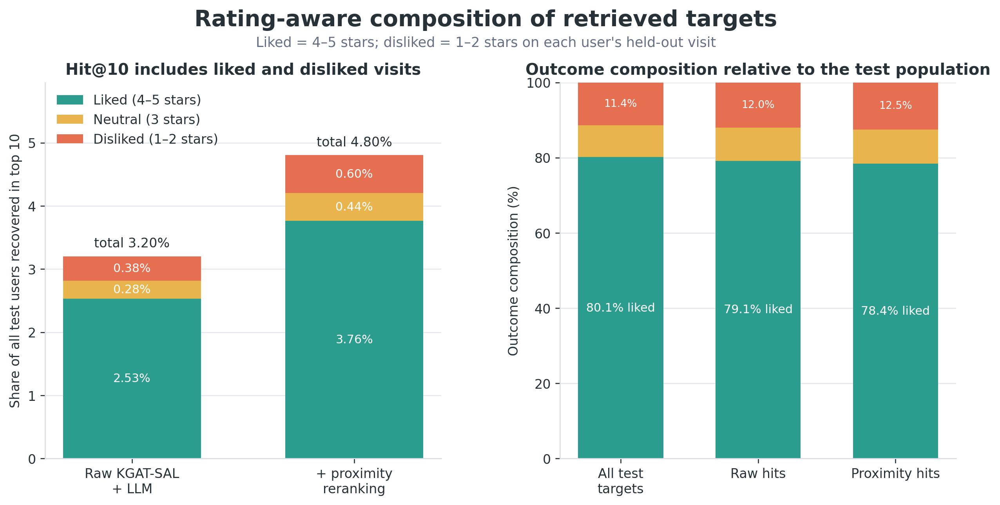
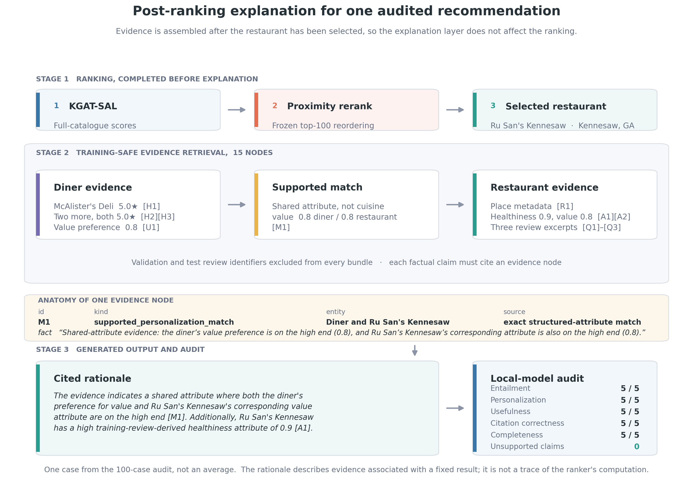

# From review text to graph recommendations: publication results draft

## Study question

Restaurant reviews contain signals that ordinary categorical metadata does not capture well:
whether a dining room feels suitable for a date or a group, whether service tends to be fast,
whether portions feel generous, which dietary restrictions are explicitly supported, and which
dishes repeatedly define a restaurant. Conventional NLP can approximate individual pieces of this
representation, but doing so generally requires a collection of task-specific classifiers,
taxonomies, lexicons, and aggregation rules. We test whether a local LLM can produce a unified,
auditable feature schema and whether those features improve restaurant ranking.

The second question is architectural. If LLM features help, do they help a conventional feature
model, a collaborative graph model, and a knowledge-graph recommender equally? Finally, after the
ranker has made its decision, can graph-grounded retrieval turn the recommendation into a useful
explanation without presenting a post-hoc rationale as the model's causal reasoning?

## Leakage-safe experimental design

The experiment uses a chronological leave-two-out split for every reviewer with at least four
unique restaurant interactions. The newest restaurant is held out for test, the second-newest for
validation, and all older interactions form the training graph. This produces 772,170 training
interactions, 156,261 validation targets, and 156,261 test targets over 61,204 restaurants with
eligible interactions.

All behavioral aggregates and dish edges are rebuilt from training interactions. The user and
restaurant LLM corpora exclude held-out review text. An explicit source-ID audit found zero overlap
between the 1,048,459 review IDs used for structured LLM features and the 312,522 validation/test
review IDs. Checkpoints are selected by validation NDCG@10; the test split is not used for epoch,
model, feature-set, or proximity-hyperparameter selection.

We compare three architectures:

1. a feature-aware Two-Tower model as the non-graph reference;
2. LightGCN as the collaborative graph baseline; and
3. KGAT-SAL, which combines collaborative propagation, restaurant knowledge relations, temporal
   periods, self-augmented learning, and spatial edges between each CBG and its five nearest CBGs.

Each architecture is trained both with conventional features and with the complete structured and
dense LLM representation. Every condition runs for 300 epochs with 1,024-dimensional embeddings
under seeds 42, 43, and 44. Primary outcomes are full-catalog Hit@10 and NDCG@10.

## LLM features help most when the architecture can use their structure

| Model | Feature condition | Hit@10 | NDCG@10 |
|---|---|---:|---:|
| Two-Tower | Conventional | 0.01634 ± 0.00015 | 0.00785 ± 0.00010 |
| Two-Tower | Conventional + LLM | 0.01649 ± 0.00015 | 0.00796 ± 0.00007 |
| LightGCN | Conventional | 0.02556 ± 0.00035 | 0.01274 ± 0.00007 |
| LightGCN | Conventional + LLM | 0.02677 ± 0.00005 | 0.01338 ± 0.00008 |
| KGAT-SAL | Conventional | 0.02862 ± 0.00026 | 0.01437 ± 0.00018 |
| **KGAT-SAL** | **Conventional + LLM** | **0.03200 ± 0.00059** | **0.01614 ± 0.00029** |

The Two-Tower reference changes little: LLM features raise NDCG@10 by 1.4% and Hit@10 by 0.9%.
LightGCN benefits more, gaining 5.0% in NDCG and 4.7% in Hit Rate. The largest improvement appears
in KGAT-SAL, where LLM features raise NDCG by 12.3% and Hit Rate by 11.8%. Both KGAT-SAL primary
metrics improve under every seed.

This interaction matters more than a generic claim that “LLM features improve recommendation.”
The same representation provides almost no benefit to the simple feature matcher but a consistent,
larger benefit to the model that can propagate information through collaborative, semantic,
temporal, and geographic relations. The result suggests that feature generation and model
architecture should be treated as a coupled design decision.

Three seeds are enough to expose gross instability but not enough to support strong asymptotic
claims about seed-level significance. Paired tests are therefore treated as exploratory. The main
evidence is the size and direction of the paired changes, together with mean and sample standard
deviation across the predeclared seeds.

## Geography remains a powerful post-ranking signal

KGAT-SAL with the complete LLM feature set is selected using mean validation NDCG@10. Proximity is
then tuned only for this selected configuration. A grid over blend weight, distance bandwidth, and
candidate depth is evaluated on validation predictions averaged across all three seeds. The frozen
configuration uses a proximity weight of 0.7, a 5 km exponential distance bandwidth, and the top
100 model candidates. User location is represented by the median coordinates of training-history
restaurants only.

| Ranking stage | Hit@10 | NDCG@10 |
|---|---:|---:|
| Raw KGAT-SAL + LLM | 0.03200 ± 0.00059 | 0.01614 ± 0.00029 |
| **Validation-tuned proximity reranking** | **0.04803 ± 0.00038** | **0.02378 ± 0.00018** |

The frozen reranker increases Hit@10 by 50.1% and NDCG@10 by 47.3% on the one-time test evaluation.
This is not a replacement for the GNN: proximity only reorders the model's top 100 candidates.
Instead, it shows that a national recommender benefits from separating two questions: which places
fit the diner, and which of those plausible places are geographically useful now?

These metrics should not be compared directly with the earlier exploratory chart reporting NDCG
above 0.05. That experiment ranked against roughly 18,879 restaurants, used 2,048-dimensional
embeddings, and used the test split during checkpoint selection. The present full-catalog candidate
universe is more than three times larger and the validation, feature, and test boundaries are
strictly separated.

## A recovered visit is not necessarily a liked restaurant

Hit@10 is an implicit-feedback measure: it counts a held-out visit as a target regardless of the
reviewer's rating. A rating-aware diagnostic defines four- and five-star visits as liked,
three-star visits as neutral, and one- and two-star visits as disliked. After proximity reranking,
positive Hit@10 is 0.03764 and disliked-target Hit@10 is 0.00600. Of recovered targets, 78.4% were
liked and 12.5% disliked, compared with 80.1% liked and 11.4% disliked in the full test population.

The recommender therefore improves visit retrieval without preferentially recovering positive
experiences. This does not invalidate the controlled architecture comparison, but it limits the
product interpretation and motivates a rating-aware objective or relevance threshold.

## GraphRAG explains rather than reranks

The final layer does not ask an LLM to replace the recommender or choose a restaurant. For sampled
top-ranked results, it retrieves a compact evidence subgraph containing the diner's training-only
restaurant history, candidate metadata, cuisine and CBG relations, supported structured LLM
attributes, and short excerpts from training-safe reviews. The explanation generator may use only
these evidence nodes, must cite every factual claim, and is instructed to paraphrase rather than
reproduce review text.

This distinction is important. The explanation is a grounded rationale for a ranked result, not a
faithful reconstruction of every internal message-passing operation. We audit it separately for
entailment, unsupported claims, personalization, usefulness, citation correctness, quote fidelity,
and held-out-data safety. Automated LLM judgments are reported as diagnostics and will be followed
by a blinded human audit before publication.

On a deterministic sample of 100 top-1 recommendations, stratified equally across user-activity
quartiles, supported personalization evidence was available for 79% of recommendations. Every
explanation with such evidence cited it. All explanations used valid evidence identifiers, cited
restaurant evidence, and used evidence bundles with no held-out review IDs. The generator followed
the no-verbatim-quotation requirement in 95% of cases.

The independent local-LLM judge scored entailment at 3.39/5, personalization at 2.34/5,
usefulness at 2.71/5, and citation correctness at 3.75/5. It flagged an average of 0.81 unsupported
claims per explanation. These results establish traceability and split safety, but they do not yet
establish publication-grade explanation quality. In particular, an evidence identifier can be
syntactically valid while the surrounding paraphrase is too broad. The GraphRAG result should
therefore be framed as a working, auditable post-ranking layer whose remaining bottleneck is
faithful verbalization, not as a completed user-facing explanation system. A blinded human audit
and prompt/retrieval error analysis remain necessary before making stronger quality claims.

One high-quality audited case makes the intended design concrete. KGAT-SAL and proximity selected
Elizabeth's in Washington, DC. The evidence graph connected the diner's training-review-derived
plant-based score of 0.9 to the restaurant's corresponding score of 1.0 and attached training-safe
review evidence about its vegan tasting menu, atmosphere, and service. The explanation cited the
attribute match for personalization and the review nodes for venue claims; the judge scored it 4/5
for entailment, 5/5 for personalization, 4/5 for usefulness, and 5/5 for citation correctness,
with zero unsupported claims.

## What the experiment supports

The evidence supports three bounded conclusions. First, a local LLM can generate a unified semantic
feature representation whose strongest value appears in a knowledge-graph recommender rather than
in a standalone feature matcher. Second, explicit geography adds substantial utility even after
spatial CBG relations have been included inside the graph. Third, GraphRAG offers a disciplined way
to verbalize recommendations after ranking, provided that retrieval is training-safe and every
claim remains traceable to evidence.

The study does not establish that conventional NLP is incapable of producing these features, that
the explanation reveals the GNN's causal mechanism, or that offline Hit@10 alone predicts user
satisfaction. Those stronger questions require task-specific NLP baselines, intervention-based
explanation tests, and prospective user evaluation.
