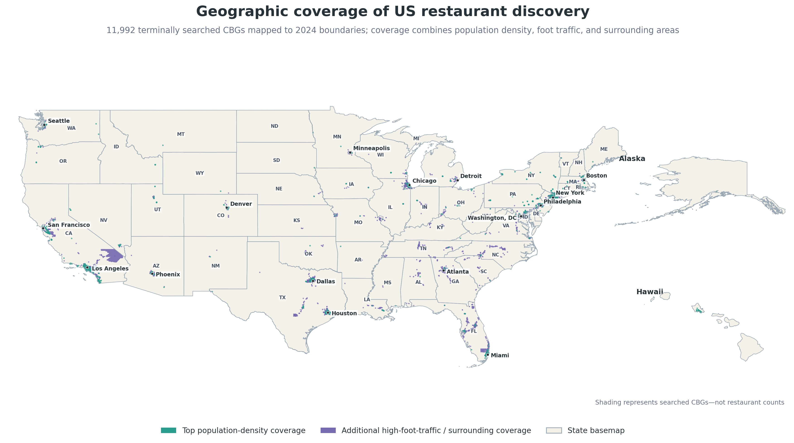
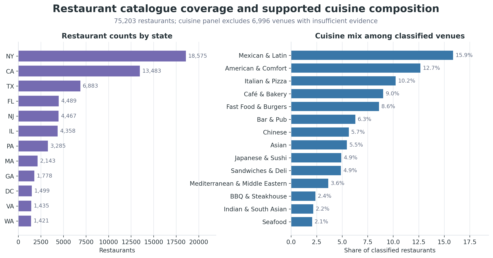
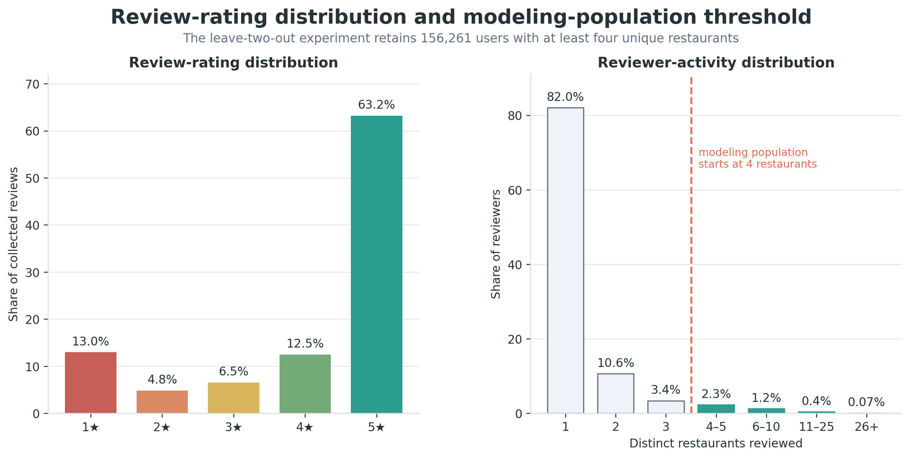
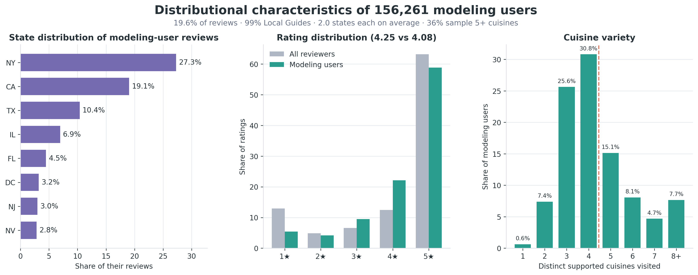
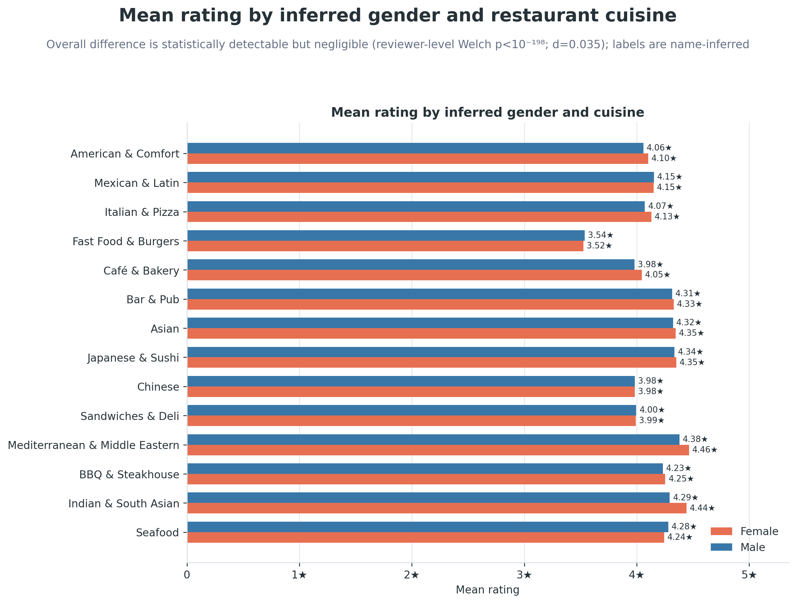
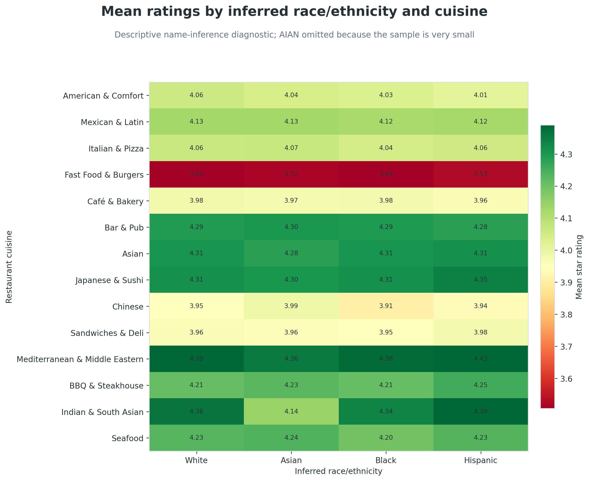
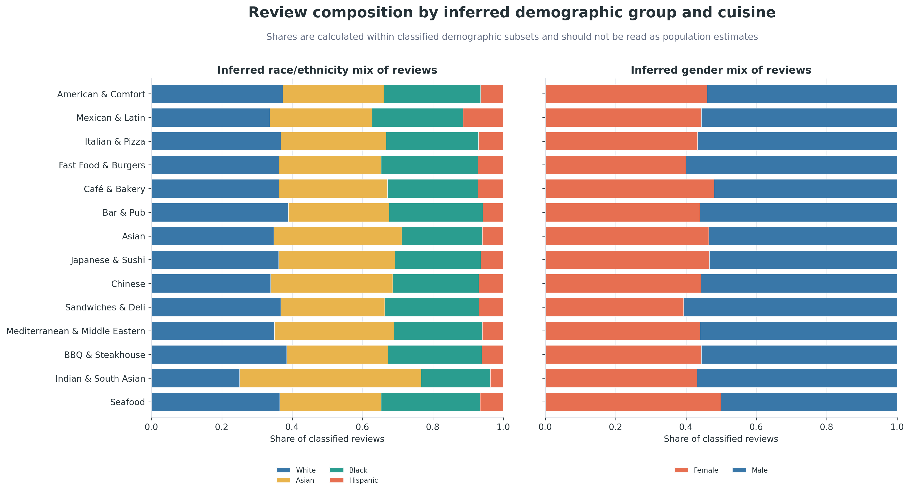

# Constructing a Geographically Targeted U.S. Restaurant-Review Corpus

**Series:** Part 1 of 4
**Previous:** [Series introduction: From Review Text to Explainable Restaurant Recommendations](PART_0_SERIES_INTRODUCTION.md)
**Next:** [Part 2: Deriving Leakage-Safe Semantic Features from Restaurant Reviews](PART_2_LLM_FEATURE_ENGINEERING.md)

## Data requirements for the study

Restaurant recommenders commonly rely on interaction histories and a limited set of attributes, such as cuisine, price, and location. These inputs do not consistently describe factors that may influence whether a restaurant suits a particular diner, including dietary accommodation, noise level, and service pace. Content-aware and knowledge-graph models can incorporate such information when the underlying data provide it.

This part evaluates whether the collected corpus supports the subsequent feature-engineering, ranking, and explanation stages. It examines geographic coverage, the availability of restaurant-level evidence, and the number of reviewers with sufficient histories for chronological evaluation.

## Corpus composition and analytical scope

The final corpus contains 75,203 restaurants and 5,544,947 reviews from 3,930,034 identified reviewers. It is a geographically targeted observational corpus rather than a probability sample of U.S. dining. Inclusion is shaped by population density, commercial activity, Google visibility, and public-review availability.

| Corpus at a glance | Count |
|---|---:|
| Restaurants | 75,203 |
| Reviews | 5,544,947 |
| Identified reviewers | 3,930,034 |
| Restaurants with at least one review | 70,625 |
| Users retained for modeling | 156,261 |

Three characteristics affect the subsequent analyses: structured metadata are incomplete, ratings are concentrated at the upper end of the scale, and only about 4% of identified reviewers have sufficient histories for chronological evaluation.

## Geographic sampling and data collection

Restaurant density varies substantially across geographic areas. To allocate the collection budget toward areas with a greater expected concentration of establishments, sampling targeted Census block groups with high population density or foot traffic.

A Census block group (CBG) is a small statistical geography that provides a finer search unit than a state or city. CBGs also support the population and neighborhood relations used later in the recommendation graph. Three forms of coverage were combined:

| Coverage component | Role in discovery |
|---|---|
| High-foot-traffic CBGs | Capture active commercial and dining areas |
| Top 10,000 density CBGs | Add dense residential and mixed-use areas |
| Surrounding CBGs and H3 cells | Reduce boundary and neighborhood gaps |

Each selected polygon was tiled with H3 cells and queried through the Google Places API, with Google Place ID as the deduplication key. Review pages were collected separately.

The collection process distinguished completed searches that returned no results from requests interrupted before completion. Treating both outcomes as evidence of no restaurants would have introduced unrecorded gaps in the sampling frame.

Figure 1 shows the resulting search footprint and distinguishes the population-density coverage from the additional high-foot-traffic and surrounding areas.

*Figure 1. Search footprint for Census block groups. The map resolves 11,992 terminal identifiers to 2024 CBG boundaries: 9,452 from population-density coverage and 2,540 from additional high-foot-traffic or surrounding coverage. Another 1,343 terminal identifiers belong to an earlier boundary vintage and are omitted rather than assigned to an incorrect polygon. This is a search-coverage map, not a restaurant-density map.*

The catalogue includes restaurants from 48 states and the District of Columbia, with no retained restaurants in Alaska or Montana. This provides broad geographic coverage, although the selected CBGs, query geometry, restaurant age, Google Maps visibility, and public-review availability all affect inclusion. Within the retained catalogue, 70,625 restaurants (93.9%) have at least one collected review and 4,578 have none.

Figure 2 summarizes restaurant coverage by state and the distribution of supported cuisine labels within the retained catalogue.

*Figure 2. Catalogue coverage and supported cuisine mix. Cuisine shares exclude restaurants without enough evidence for a supported cuisine label; those restaurants remain in the analytical tables and recommendation candidate set.*

## Metadata completeness and cuisine classification

Every restaurant record includes an address and geographic coordinates, but several attributes relevant to recommendation are incomplete.

Figure 3 reports the missingness of the principal structured fields and the results of the cuisine-label classification step.

*Figure 3. Catalogue field completeness and cuisine label resolution. Price level is absent for 59.2% of restaurants and an aggregate rating for 43.6%. The cuisine repair assigns a supported name only where evidence exists, and 6,996 restaurants retain no supported label.*

A model using the declared price tier would therefore have an observed value for fewer than half of the restaurants. Values supplied through imputation would represent modeling assumptions rather than observed metadata.

Google's broad type mapping assigned 15,747 restaurants (20.9%) to `Other`. A targeted language-model classification step evaluated these records using restaurant names, place types, summaries, and review evidence, producing supported cuisine labels for 8,751 restaurants. The remaining 6,996 restaurants (9.3% of the catalogue) are recorded as unknown rather than assigned an unsupported label. They remain in the dataset and recommendation candidate set but are excluded from cuisine-specific chart denominators.

The resulting taxonomy is long-tailed. Among the 68,207 restaurants with a supported label, 34 categories are represented; the five largest contain 56.4% of restaurants and the fourteen largest contain 93.9%. Part 3 reports cuisine-segmented results for these fourteen categories because the remaining samples are too small to support stable rate estimates.

Together, the field-completeness and cuisine-classification audits quantify the limitations of the structured metadata. Review text is present for 83.6% of review rows and averages 265.2 characters, making it the most consistently available source of descriptive information in the corpus. Part 2 evaluates how much usable semantic and contextual information remains when features are required to have direct textual support.

> **Fact-check flag.** The frozen cuisine-repair table implies 10,138 resolved rows against the canonical supported-name count of 8,751. The 1,387-row difference is unexplained by the supplied artifacts and is listed as a required reconciliation in the editorial handoff. No claim in this series depends on the method split.

## Rating and reviewer-activity distributions

The rating distribution is concentrated at the top. Of the 5,531,203 reviews carrying a star rating (99.8% of the corpus), 63.2% have five stars and 12.5% have four. Reviewer activity is concentrated at the other extreme: 82.0% of identified reviewers appear at only one restaurant.

These distributions, shown in Figure 4, affect the experimental design. Low ratings provide a comparatively limited signal, and most reviewers do not have enough distinct visits to support a chronological evaluation split.

*Figure 4. Ratings and reviewer activity. The modeling threshold begins at four distinct restaurants so that each retained user still has training history after one validation and one test restaurant are held out.*

The 156,261 users retained for modeling represent 4.0% of the 3,930,034 identified reviewers. They contribute 1,084,692 interactions, or 19.6% of all reviews, with a mean of 6.94 interactions per user. Ranking metrics in Part 3 are therefore computed for a relatively active subset of reviewers rather than for the full review population. Part 3 describes the chronological evaluation split in detail.

Figure 5 characterizes this modeling population by geographic range, rating behavior, and cuisine breadth.

*Figure 5. Profile of the modeling population. Every included user has interacted with at least four distinct restaurants.*

## Distribution of textual and photographic evidence

Review length and photo attachment vary with star rating, affecting the distribution of evidence available for feature extraction.

Figure 6 compares the mean review length and photo count at each rating level and shows how review rows, text, and photographs are distributed across ratings.

*Figure 6. Review evidence by star rating, computed over the 5,531,203 rated reviews. Per-review length falls toward positive ratings while photo counts are highest at four stars. In aggregate, one- and two-star reviews contribute 26.3% of all text from 17.8% of rows.*

Two-star reviews are the longest on average, at 406.1 characters, compared with 385.6 for one-star reviews and 223.0 for five-star reviews. Photo attachment is highest for four-star reviews, at 0.96 photos per review, and is 16.0% lower for five-star reviews, at 0.81.

Across the approximately 1.46 billion stored characters in rated reviews, one- and two-star reviews account for 17.8% of rows but 26.3% of all text. Five-star reviews account for 63.2% of rows, 53.2% of text, and 70.7% of attached photos. Text-based and image-based feature pipelines would therefore receive different rating-weighted evidence distributions.

## Descriptive demographic diagnostics

The study includes aggregate gender and race/ethnicity diagnostics derived from reviewer names. These labels are probabilistic inferences, not self-reported identities. They are inappropriate for individual targeting or population estimation and cannot support a fairness certification.

Coverage is itself a caveat. Gender inference returns a classified label for 74.4% of identified reviewers and an explicit `unknown` for the remaining 25.6%; race/ethnicity inference returns a label for all of them. Every group comparison below is conditioned on the classified subset, which is not a random sample of reviewers.

Among classified review rows, female-coded reviewers average 4.13592 stars and male-coded reviewers average 4.09744; both medians are 5.0. Because multiple reviews from one person violate the independence assumption of a review-level comparison, the primary test uses one mean rating per reviewer. Figure 7 presents the corresponding cuisine-level comparison on the full rating scale.

At the reviewer level, Welch's *t* = 30.09 and *p* = 8.0×10⁻¹⁹⁹, with a 95% confidence interval for the difference of [0.0475, 0.0541] stars. The sample is large enough to make a very small difference statistically detectable. Cohen's *d* = 0.035 shows the magnitude is practically negligible, roughly one twenty-eighth of a standard deviation, on a scale whose median is 5.0 for both groups.

*Figure 7. Mean rating by supported cuisine and inferred gender. The full rating scale prevents small differences from appearing visually large.*

| Analysis unit | Female mean | Male mean | Difference |
|---|---:|---:|---:|
| Review row | 4.13592 | 4.09744 | +0.03848 |
| Reviewer mean | 4.09687 | 4.04610 | +0.05077 |

*Figure 8. Cuisine-conditioned mean ratings for sufficiently represented inferred race/ethnicity groups. Labels are name-inferred proxies, not self-reported identity.*

Figure 8 shows that differences between cuisine categories are larger than most within-cuisine differences among the displayed inferred groups. Mean ratings for Fast Food & Burgers range from 3.49059 to 3.52723 across the four groups, whereas ratings for Mediterranean & Middle Eastern restaurants range from 4.35517 to 4.42896. The difference between these two cuisines is 0.84 to 0.90 stars within each group. For 13 of the 14 cuisines, the difference between the highest and lowest displayed group mean is below 0.08 stars.

Indian & South Asian is the exception. Its displayed means range from 4.13877 for the Asian-coded group to 4.38843 for the Hispanic-coded group, a spread of 0.25 stars against at most 0.08 for every other displayed cuisine, the next largest being Chinese at 0.076.

The analysis does not identify the source of this difference. It may reflect variation in the restaurants, geographic markets, formats, price levels, reviewer composition, or inferred-group assignments represented within the cuisine category. Because the comparison does not hold the restaurant or market constant, it should not be interpreted as evidence of a group-level rating mechanism.

The group sizes also differ by more than an order of magnitude. The Asian-coded mean rests on 60,308 reviews and the Hispanic-coded mean on 4,271, a ratio of roughly 14 to 1. The larger mean is correspondingly more stable, and the smaller one is more exposed to composition effects: a few thousand reviews concentrated in particular markets or restaurants can move it in a way the same disturbance could not move the other. The comparison is a descriptive flag for further analysis, not evidence of a group-level preference mechanism.

Figure 9 shows that composition within the classified subsets also varies. Seafood is close to balanced at 49.9% female-coded and 50.1% male-coded reviews. Sandwiches & Deli has the largest male-coded share at 60.7%, with Fast Food & Burgers close behind at 60.0%. Asian-coded reviews constitute 51.6% of the classified Indian & South Asian subset, and Hispanic-coded reviews account for 11.4% of the Mexican & Latin subset, compared with 3.7% to 7.2% across the other displayed cuisines.

*Figure 9. Review composition by inferred demographic group and cuisine. Shares are calculated within the classified demographic subsets. They reflect the collected review population, geographic coverage, and name-inference procedure and should not be interpreted as population-level cuisine preferences.*

Taken together, these analyses establish a geographically broad, provenance-tracked corpus while identifying the conditions governing its use: targeted geographic sampling, incomplete metadata, a modeling cohort restricted to the 4.0% of reviewers with sufficient histories, and demographic labels inferred from names. The subsequent experiments evaluate held-out visit retrieval within the interacted catalogue, report satisfaction-related outcomes separately—more than 78% of top-10 hits were rated four or five stars—and leave transfer to other catalogues and user populations for future evaluation.

## Key findings

- Collection targeted high-density and high-foot-traffic Census block groups, producing 75,203 restaurants across 48 states and the District of Columbia and 5,544,947 reviews from 3,930,034 identified reviewers.
- Structured metadata are incomplete: price level is missing for 59.2% of restaurants, aggregate rating for 43.6%, and 9.3% retain no supported cuisine label after classification.
- Review text is present for 83.6% of review rows, making it the most consistently available source of descriptive restaurant information in the corpus.
- Ratings are concentrated at the upper end of the scale, with 63.2% at five stars. One- and two-star reviews contribute 26.3% of all review text while representing 17.8% of rated rows.
- Only 4.0% of reviewers have sufficient histories for chronological evaluation. These users contribute 19.6% of reviews and define the population used for ranking evaluation in Part 3.
- Name-inferred demographic diagnostics identify a statistically detectable but practically negligible gender difference in ratings (Cohen's *d* = 0.035). Descriptive differences between cuisine categories are larger than most within-cuisine differences among inferred groups.

[Part 2](PART_2_LLM_FEATURE_ENGINEERING.md) takes up the gap this article measures: turning review text into model inputs without letting a held-out review describe the restaurant it is supposed to predict.

**Series navigation:** [Previous: Introduction](PART_0_SERIES_INTRODUCTION.md) · [Next: Part 2](PART_2_LLM_FEATURE_ENGINEERING.md)
