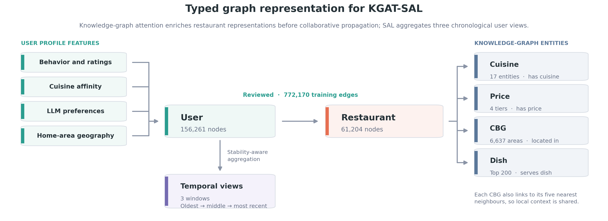
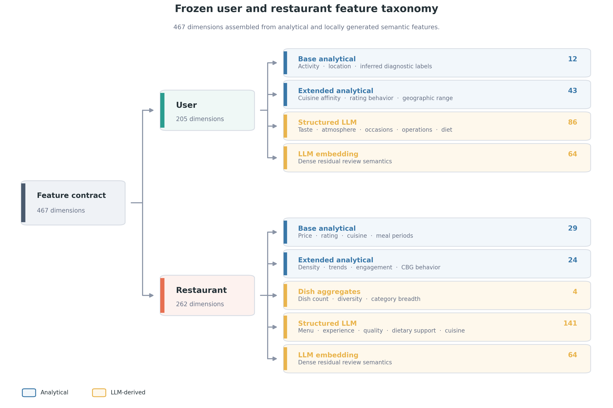
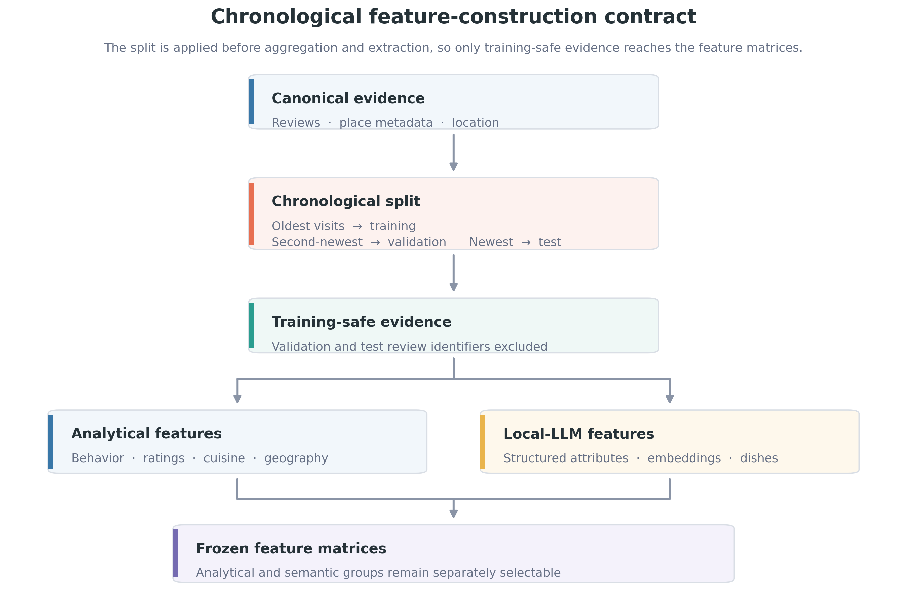

# Deriving Leakage-Safe Semantic Features from Restaurant Reviews

*A review-based feature pipeline with explicit evidence requirements, measured coverage, and chronological source controls.*

**Series:** Part 2 of 4
**Previous:** [Part 1: Constructing a Geographically Targeted U.S. Restaurant-Review Corpus](PART_1_DATA_COLLECTION_AND_EDA.md)
**Next:** [Part 3: Evaluating LLM-Derived Features, Graph Architectures, and Proximity Reranking](PART_3_MODEL_EVALUATION.md)

Interaction histories indicate where a diner has visited, while review text can describe contextual factors such as atmosphere, service pace, dietary accommodation, and specific dishes. Part 1 showed that this text is substantially more available than several structured fields: price level is missing for 59.2% of restaurants and aggregate rating for 43.6%, whereas 83.6% of review rows contain text.

This part examines how review text is converted into structured attributes, dense semantic representations, and dish-related signals without allowing held-out interactions to influence feature construction. The language model is used as a feature-extraction component rather than as the ranker. Its role is to apply a shared extraction schema across several semantic dimensions; this is a consolidation strategy, not a claim that conventional task-specific natural-language processing methods could not produce comparable signals.

## Graph representation and frozen feature contract

The recommendation graph contains 156,261 eligible user nodes, 61,204 restaurants observed in the ranking population, and 772,170 chronological training interactions. Restaurant nodes connect to 17 cuisine entities, four price tiers, 6,637 Census block-group (CBG) entities, and the 200 most frequent dishes extracted from training-period reviews. Each CBG also connects to its five nearest CBGs.

Figure 1 shows how collaborative, semantic, and spatial information enter the typed graph. KGAT-SAL—the Knowledge Graph Attention Network with Stability-Aware Learning used in this study—aggregates information over restaurant relations and then propagates it through the user–restaurant interaction graph. Validation and test interactions remain outside the training graph.

*Figure 1. Typed KGAT-SAL graph. User and restaurant features attach to nodes; 772,170 training interactions form the collaborative graph, while validation and test interactions remain outside it.*

The graph uses 17 cuisine entities, whereas Part 1 reports 34 supported catalogue categories. The graph therefore operates with a coarser cuisine grouping; the mapping between the two taxonomies is not documented in the frozen artifacts.

The frozen feature matrices contain 156,261 users by 205 features and 75,203 restaurants by 262 features. Both experimental conditions use the same interaction split, cuisine taxonomy, analytical features, and spatial relations. The conventional condition excludes the `llm`, `llm_embedding`, and `dish_llm` groups and disables dish relations derived from review text. The augmented condition adds those groups and the training-only dish edges.

Figure 2 summarizes the feature taxonomy, and the table reports its dimensions.

*Figure 2. Frozen feature taxonomy. Blue groups are analytical; gold groups are derived from the language-model and dish-extraction pipeline. Group sizes sum to 205 user features and 262 restaurant features.*

| Side | Conventional groups | Added semantic groups |
|---|---|---|
| User | 12 base + 43 extended | 86 structured + 64 embedding |
| Restaurant | 29 base + 24 extended | 4 dish + 141 structured + 64 embedding |

The added condition contains 150 user columns and 209 restaurant columns spanning named attributes, 64-dimensional semantic representations, dish aggregates, and dish edges. Consequently, the comparison in Part 3 evaluates the bundle as a whole; without component-level ablations, any performance change cannot be assigned to one feature family.

## Evidence-based semantic feature construction

A structured value is stored only when the source place types or review text contain a direct lexical mention. When no supporting mention is present, the value is recorded as unknown rather than interpreted as negative evidence. For example, silence about outdoor seating does not indicate that a restaurant lacks it.

Figure 3 shows that this rule produces substantial variation in coverage. Value is populated for 62.5% of restaurants, while vegan accommodation is populated for 3.6% and BYOB status for 0.6%. The representation is therefore consistent in schema but not in density.

*Figure 3. Structured-attribute coverage and evidence backing. Coverage ranges from 62.5% to 0.6% of the catalogue, and asserted confidence does not consistently correspond to direct lexical support.*

| Attribute | Restaurants with a value | Catalogue coverage | Evidence-backed share |
|---|---:|---:|---:|
| Value | 46,995 | 62.5% | 0.816 |
| Service sentiment | 31,471 | 41.8% | 0.939 |
| Service speed | 20,185 | 26.8% | 0.850 |
| Bar on site | 13,084 | 17.4% | not scored |
| Spice level | 6,326 | 8.4% | 0.834 |
| Vegetarian offering | 4,435 | 5.9% | positive evidence only |
| Outdoor seating | 2,951 | 3.9% | 0.643 |
| Vegan offering | 2,675 | 3.6% | positive evidence only |
| BYOB | 475 | 0.6% | not scored |

The dietary fields are populated only when positive evidence is present, so their evidence-backed share is 1.0 by construction. This increases provenance confidence but limits coverage. Such fields can support individual matches when evidence exists, but they do not provide a catalogue-wide dietary signal.

Asserted confidence is not a consistent substitute for evidence verification. In Figure 3, high- and low-confidence service-speed assertions have nearly identical evidence-backed rates, at 82.7% and 83.0%. The corresponding rates are 83.9% and 29.5% for spice level and 76.0% and 5.3% for outdoor seating. The direct-evidence requirement, rather than a confidence threshold alone, determines whether an extracted value is retained.

Figure 4 compares asserted extraction confidence across broader semantic dimensions. Restaurant-side confidence is highest for cuisine, with a mean of 0.938, and lowest for dietary accommodation, at 0.801. User-side confidence is lower across all six reported dimensions; dietary preference is lowest at 0.660. This pattern is consistent with restaurant profiles aggregating more review evidence than individual user profiles, although the current audit does not directly test confidence against source-review volume.

*Figure 4. Asserted extraction confidence by semantic dimension for restaurant and user profiles. Dietary accommodation has the lowest mean confidence on both sides.*

These values are the extractor's own confidence scores, not accuracy estimates against labeled reference data. A labeled source-text audit is required to determine whether the extracted attributes are correct.

## Chronological controls and source audit

For each eligible user, the newest unique restaurant is assigned to test, the second-newest to validation, and earlier restaurants to training. As shown in Figure 5, this split is applied before analytical aggregation or semantic extraction. User profiles therefore contain training interactions only. Restaurant corpora may include auxiliary reviews, but exclude every validation- and test-review identifier, even when the restaurant also has permissible training evidence.

*Figure 5. Chronological feature-construction contract. Splitting precedes aggregation and extraction, so only training-safe evidence reaches the user and restaurant matrices.*

The ordering prevents held-out text from entering a restaurant profile and revealing information about the target interaction. Because multiple reviews are aggregated into restaurant-level features, the source audit compares review identifiers rather than only feature rows.

| Source set | Review identifiers | Share of the 5,544,947-review corpus |
|---|---:|---:|
| Structured-feature evidence | 1,048,459 | 18.9% |
| Validation and test | 312,522 | 5.6% |
| Intersection | **0** | **0.0%** |

No review identifier used as structured-feature evidence appears in the validation or test sets. This establishes source separation for the audited structured-feature pipeline. It does not measure extraction accuracy or verify every artifact produced elsewhere in the broader feature pipeline.

## Discussion

The method produces a common semantic representation from heterogeneous review text while preserving explicit missingness and a chronological evaluation boundary. Its main methodological contribution is the combination of a shared extraction schema, direct-evidence gating, and source-level provenance controls. Part 3 evaluates whether the resulting feature bundle improves recommendation performance across architectures.

The results in this part also identify three constraints. First, attribute coverage depends on what reviewers choose to mention and varies from 62.5% to 0.6%, with dietary fields among the sparsest. Additional reviews, longer user histories, and broader evidence sources could increase coverage, but any expansion should retain the same direct-evidence requirement. Second, model confidence is not an accuracy measure. A larger or independently trained model may improve extraction and evaluation, but this requires validation against labeled source-text examples rather than inference from model size alone. Third, the augmented condition combines structured attributes, embeddings, dish aggregates, and graph edges, so component-level ablations are needed to identify which inputs account for downstream gains.

The zero-overlap audit provides evidence that held-out reviews did not enter the audited structured features. Broader machine-readable provenance across every derived artifact, a documented mapping between the 34 catalogue cuisine labels and 17 graph entities, and a larger labeled extraction audit would strengthen reproducibility and allow the pipeline's accuracy and transferability to be evaluated directly.

## Key findings

- Review text provides the most consistently available descriptive evidence in the catalogue and is converted into structured attributes, dense representations, and dish-related signals.
- The augmented condition adds 150 user features and 209 restaurant features as one bundle; Part 3 cannot attribute its effect to an individual component without further ablation.
- Values are retained only when direct evidence is present, and unmentioned attributes remain unknown rather than being interpreted as negative.
- Attribute coverage ranges from 62.5% for value to 0.6% for BYOB; vegan accommodation covers 3.6% of restaurants.
- Asserted confidence does not consistently predict evidence backing and should not replace source verification.
- User-side confidence is lower than restaurant-side confidence, with dietary preference the least confident dimension.
- The chronological split precedes aggregation and extraction, and the source audit finds zero overlap between 1,048,459 evidence-review identifiers and 312,522 held-out identifiers.
- The audit establishes provenance for the structured-feature source set, not extraction accuracy; labeled validation and broader provenance tracing remain necessary.

[Part 3](PART_3_MODEL_EVALUATION.md) evaluates the conventional and augmented feature contracts across a feature-aware Two-Tower model, LightGCN, and KGAT-SAL, followed by proximity reranking.

**Series navigation:** [Introduction](PART_0_SERIES_INTRODUCTION.md) · [Previous: Part 1](PART_1_DATA_COLLECTION_AND_EDA.md) · [Next: Part 3](PART_3_MODEL_EVALUATION.md)
