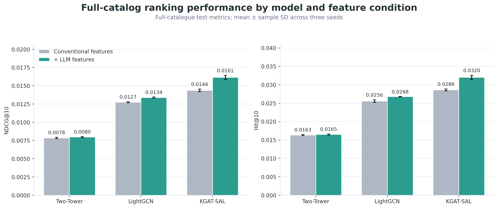
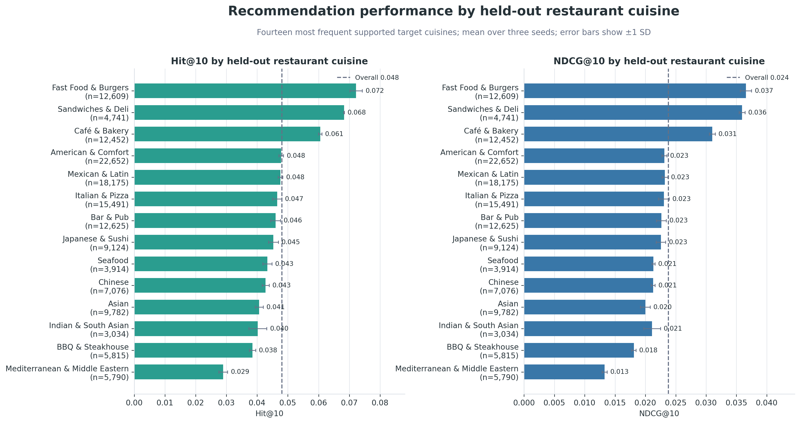
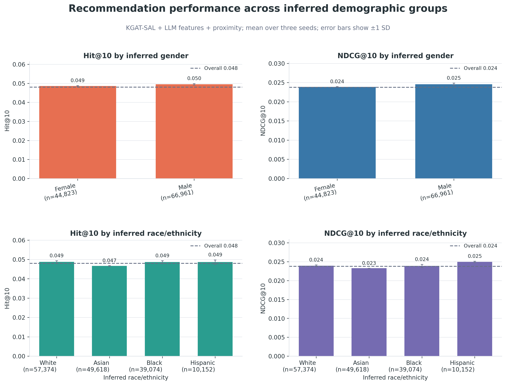

# Evaluating LLM-Derived Features, Graph Architectures, and Proximity Reranking

*A full-catalogue evaluation of architecture-dependent semantic-feature gains, geographic reranking, and variation across cuisine, demographic, and rating groups.*

**Series:** Part 3 of 4
**Previous:** [Part 2: Deriving Leakage-Safe Semantic Features from Restaurant Reviews](PART_2_LLM_FEATURE_ENGINEERING.md)
**Next:** [Part 4: Auditing Post-Ranking GraphRAG Explanations for Provenance and Grounding](PART_4_GRAPHRAG_EXPLANATIONS.md)

Part 2 defined a leakage-safe feature contract containing structured attributes, dense semantic representations, dish aggregates, and dish relations derived from review text. This part evaluates whether that bundle improves restaurant ranking and whether its effect varies across recommender architectures. It then measures the additional contribution of an explicitly geographic reranking rule.

The evaluation ranks held-out visits rather than predicted satisfaction. Ranking is performed over the full interacted catalogue rather than a sampled candidate set, so absolute metric values are expected to be small. A separate rating-aware analysis examines whether retrieved visits were subsequently rated positively.

## Evaluation design

Users with at least four distinct restaurant interactions are retained. For each of the 156,261 eligible users, the newest restaurant is assigned to test, the second-newest to validation, and all earlier restaurants to training.

| Split | Interactions |
|---|---:|
| Training | 772,170 |
| Validation | 156,261 |
| Test | 156,261 |

The temporal boundary applies to interaction labels, behavioral aggregates, user profiles, review-derived features, graph edges, checkpoint selection, proximity tuning, and explanation evidence. Part 2 documents the source-level controls used to prevent held-out review text from entering the feature matrices.

Ranking covers 61,204 restaurants observed among eligible interactions. Training and validation restaurants are excluded from each user's test candidate list. Three architectures are compared:

- **Two-Tower:** directly scores feature-aware user and restaurant representations without graph propagation;
- **LightGCN:** propagates collaborative information over the user–restaurant interaction graph; and
- **KGAT-SAL:** combines collaborative propagation with typed knowledge-graph relations and temporal user views.

All conditions use 1,024-dimensional embeddings, a fixed 300-epoch budget, and seeds 42, 43, and 44. Validation normalized discounted cumulative gain at rank 10 (NDCG@10) selects checkpoints. Hit@10 measures whether the held-out restaurant appears among the first ten results; NDCG@10 additionally rewards a higher position within that list.

Results are reported as the mean and sample standard deviation across three seeds. These runs describe direction and run-to-run variation but do not support claims of statistical significance. For scale, a uniform-random ranker over 61,204 candidates would have Hit@10 of approximately 0.00016.

## Architecture and semantic-feature results

Figure 1 compares the conventional and augmented feature conditions for each architecture.

*Figure 1. Full-catalogue model and feature comparison. Values are means across seeds 42, 43, and 44; error bars show sample standard deviation.*

| Model | Features | Hit@10 | NDCG@10 |
|---|---|---:|---:|
| Two-Tower | Conventional | 0.01634 ± 0.00015 | 0.00785 ± 0.00010 |
| Two-Tower | + LLM-derived | 0.01649 ± 0.00015 | 0.00796 ± 0.00007 |
| LightGCN | Conventional | 0.02556 ± 0.00035 | 0.01274 ± 0.00007 |
| LightGCN | + LLM-derived | 0.02677 ± 0.00005 | 0.01338 ± 0.00008 |
| KGAT-SAL | Conventional | 0.02862 ± 0.00026 | 0.01437 ± 0.00018 |
| **KGAT-SAL** | **+ LLM-derived** | **0.03200 ± 0.00059** | **0.01614 ± 0.00029** |

Relative to each conventional condition, the augmented bundle changes NDCG@10 by +1.4% for Two-Tower, +5.0% for LightGCN, and +12.3% for KGAT-SAL. KGAT-SAL Hit@10 increases by 11.8%. The Two-Tower Hit@10 difference reverses direction in one seed and is similar in magnitude to its run-to-run variation, so the bundle does not reliably improve that model. LightGCN and KGAT-SAL improve on both metrics in all three seeds.

The increasing gains are consistent with an interaction between semantic features and relational architecture. They do not identify a causal message-passing mechanism. The augmented condition also combines structured attributes, embeddings, dish aggregates, and dish relations, so its effect cannot be assigned to an individual component without additional ablations.

Test performance is lower than validation performance for every condition. Test retains 81.6% to 82.3% of validation Hit@10 for Two-Tower and 74.5% to 76.5% for the graph models. Because the test target is one interaction further from the training history, this difference may reflect temporal distance, although the current design does not isolate the cause.

## Proximity reranking

KGAT-SAL includes relations between each Census block group and its five nearest neighbors, allowing spatial context to influence learned representations. These relations do not directly constrain the final ranking by distance. The proximity stage therefore reranks the model's top 100 candidates using an exponential decay from the median coordinate of the user's training restaurants.

Blend weight, bandwidth, and candidate depth were selected using validation predictions averaged across the three seeds. The selected configuration was then frozen before test evaluation.

| Frozen setting | Value |
|---|---:|
| Distance weight (α) | 0.7 |
| Bandwidth | 5 km |
| Candidate depth | 100 |

| Stage | Hit@10 | NDCG@10 |
|---|---:|---:|
| KGAT-SAL + LLM-derived features | 0.03200 ± 0.00059 | 0.01614 ± 0.00029 |
| + proximity reranking | **0.04803 ± 0.00038** | **0.02378 ± 0.00018** |
| Relative change | **+50.1%** | **+47.3%** |

All three seeds improve on both metrics, with Hit@10 changes of +0.01581, +0.01602, and +0.01627. Figure 2 places this gain on the same absolute scale as the architecture and feature changes.

*Figure 2. Absolute changes in test Hit@10 and cumulative performance relative to the uniform-random ranking floor.*

| Intervention | Change in test Hit@10 |
|---|---:|
| LLM-derived features on Two-Tower | +0.00015 |
| LLM-derived features on LightGCN | +0.00120 |
| LightGCN to KGAT-SAL, conventional features | +0.00306 |
| LLM-derived features on KGAT-SAL | +0.00338 |
| Two-Tower to LightGCN, conventional features | +0.00922 |
| Proximity reranking on KGAT-SAL + LLM-derived features | +0.01603 |

The proximity gain is approximately 4.75 times the semantic-feature gain on KGAT-SAL. The move from Two-Tower to LightGCN contributes +0.00922 Hit@10, approximately 2.7 times the KGAT-SAL semantic-feature gain. In this experiment, collaborative structure contributes more than the feature bundle, and explicit geographic ordering contributes the largest incremental improvement.

All 84 validation configurations improve upon the unreranked model, indicating that the direction of the proximity effect is not limited to one parameter setting. However, only one configuration is within 1% of the best validation result, and the selected values lie at the boundary of all three searched ranges. The sweep therefore supports the presence of a proximity benefit but does not establish that the chosen grid contains the optimum.

## Segment and rating-aware results

Figure 3 reports final-pipeline performance for the fourteen most frequent supported held-out cuisines, which contain 143,280 of 156,261 test targets. Hit@10 ranges from 0.02896 for Mediterranean and Middle Eastern restaurants to 0.07220 for Fast Food and Burgers.

*Figure 3. Final-pipeline performance by the corrected cuisine label of the held-out restaurant.*

Cuisine Hit@10 varies by 149.3%, whereas the ratio of NDCG@10 to Hit@10 varies by 14.7%. The principal difference is therefore whether a target enters the top ten rather than where it is placed after retrieval. Catalogue frequency is positively correlated with segment Hit@10 (Spearman ρ = +0.64), while held-out targets per catalogue restaurant are negatively correlated with it (ρ = −0.45). With fourteen segments, these descriptive correlations do not isolate whether catalogue size, geographic concentration, chain representation, or taxonomy breadth explains the differences.

Figure 4 compares the same final pipeline across name-inferred demographic groups. Hit@10 ranges from 0.04663 to 0.04874 across the displayed race and ethnicity groups, while the male-coded group scores 0.04954 and the female-coded group 0.04859. These labels are probabilistic proxies rather than self-reported identities, and unknown gender labels are omitted. The comparison is therefore descriptive and should not be interpreted as a fairness certification.

*Figure 4. Final-pipeline performance by name-inferred demographic group. Error bars show sample standard deviation across three seeds.*

The rating-aware analysis distinguishes liked targets, rated four or five stars, from neutral three-star and disliked one- or two-star targets. Among visits retrieved in the top ten, 78.4% received four or five stars, compared with 80.1% of all held-out targets. The mean rating is 4.17 among hits and 4.24 across all targets.

Figure 5 shows that final Hit@10 is similar across one- to four-star targets, ranging from 0.05162 to 0.05339, and lower for five-star targets at 0.04555. Proximity reranking improves every rating group by approximately 1.5 times, with no monotonic relationship between rating and improvement.

*Figure 5. Hit@10 by held-out star rating before and after proximity reranking.*

These results show that most retrieved visits were positively rated, but Hit@10 remains a measure of visit retrieval rather than satisfaction. A satisfaction-oriented system would require a rating-aware or utility-weighted training objective rather than interpreting an implicit interaction as uniformly positive.

## Discussion

The experiment identifies an architecture-dependent benefit from review-derived features. The effect is not reliable for Two-Tower, is consistent but moderate for LightGCN, and is largest for KGAT-SAL. This pattern supports the use of semantic features with graph architectures capable of combining them with collaborative and typed relational structure, while leaving the contribution of individual feature families unresolved.

Proximity reranking provides the largest incremental improvement, raising Hit@10 by 50.1% and NDCG@10 by 47.3% over KGAT-SAL with review-derived features. This finding indicates that learned spatial context and explicit distance-based ordering perform different functions. It does not establish that the graph's CBG relations are unnecessary; a CBG-edge ablation would be required for that conclusion.

Several limitations define the next evaluation steps. Three seeds characterize direction but not statistical significance. The augmented feature condition requires structured-only, embedding-only, and dish-relation ablations. The selected KGAT-SAL checkpoints occur at epoch 275 or 300, indicating that longer training may be needed to assess convergence. The proximity grid should be extended beyond its current boundaries, and distance-only or most-popular-nearby baselines are needed to isolate the value of personalization. Larger and more diverse evaluation samples would improve subgroup and cuisine estimates, while a rating-aware objective would be required to optimize satisfaction directly.

Within these constraints, the results support a practical ranking structure for restaurant-discovery and food-delivery applications: graph-based recommendation using review-derived features, followed by a separately validated proximity stage. The relative contribution of each component should be re-evaluated when applied to a different catalogue, geographic coverage pattern, or user population.

## Key findings

- Review-derived features produce architecture-dependent gains: no reliable Hit@10 change for Two-Tower, consistent improvements for LightGCN, and the largest gain for KGAT-SAL.
- KGAT-SAL improves by 11.8% in Hit@10 and 12.3% in NDCG@10 when the augmented feature bundle is added.
- Proximity reranking raises Hit@10 from 0.03200 to 0.04803 and NDCG@10 from 0.01614 to 0.02378, the largest incremental gain in the study.
- All 84 proximity configurations improve validation performance, although the selected setting lies at the boundary of the searched grid.
- Performance differences across cuisine categories are substantially larger than the displayed differences across name-inferred demographic groups.
- More than 78% of retrieved top-10 visits were rated four or five stars, but retrieved visits are slightly less positively rated than the full target set; Hit@10 should therefore not be interpreted as satisfaction.
- Further evaluation requires more seeds, longer training, component and spatial-relation ablations, broader samples, and non-personalized geographic baselines.

[Part 4](PART_4_GRAPHRAG_EXPLANATIONS.md) evaluates whether a fixed recommendation can be accompanied by a concise rationale grounded in training-safe, inspectable evidence.

**Series navigation:** [Introduction](PART_0_SERIES_INTRODUCTION.md) · [Previous: Part 2](PART_2_LLM_FEATURE_ENGINEERING.md) · [Next: Part 4](PART_4_GRAPHRAG_EXPLANATIONS.md)
